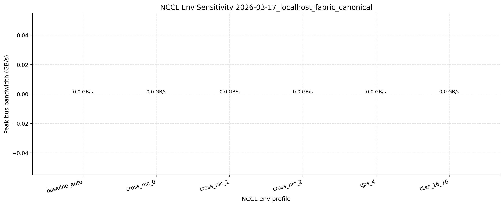
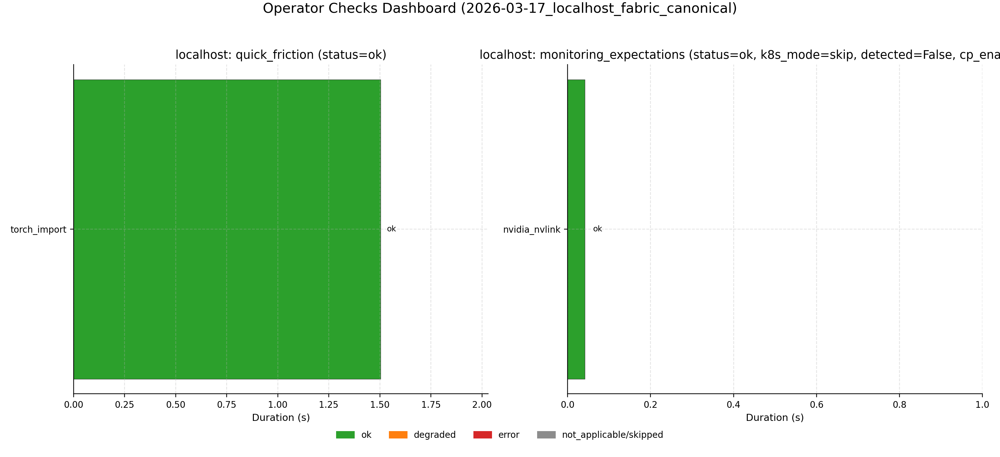
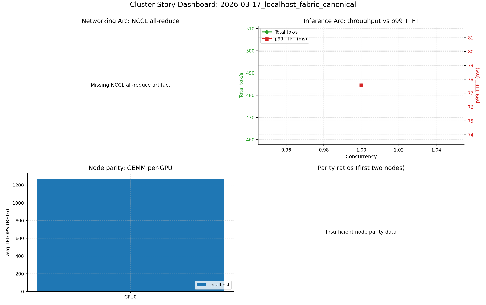
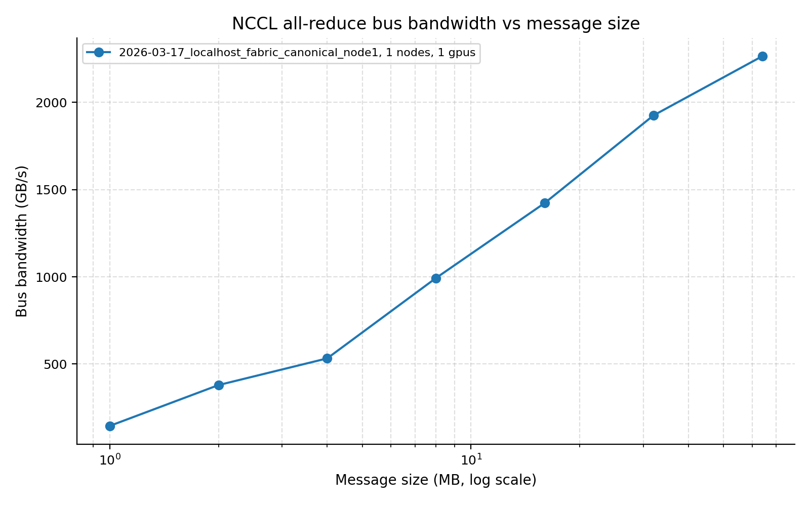
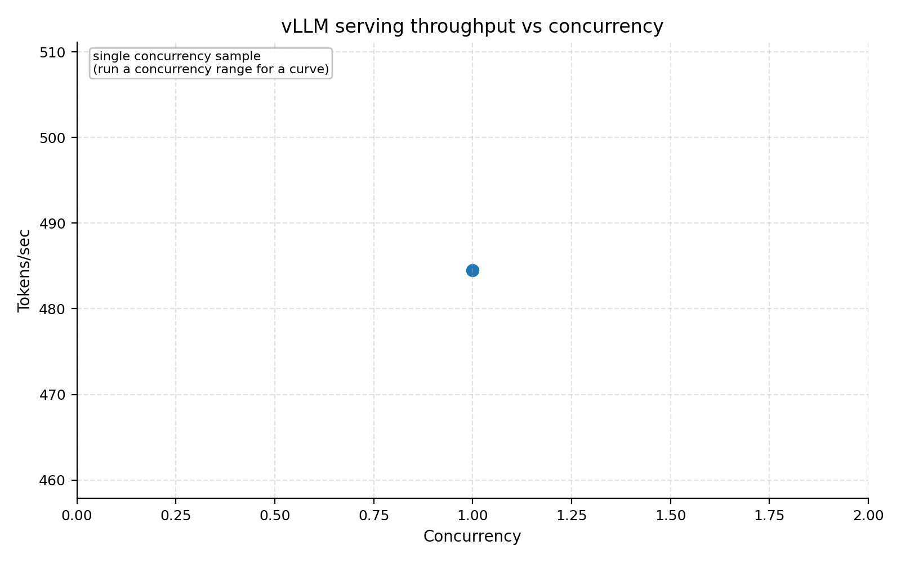
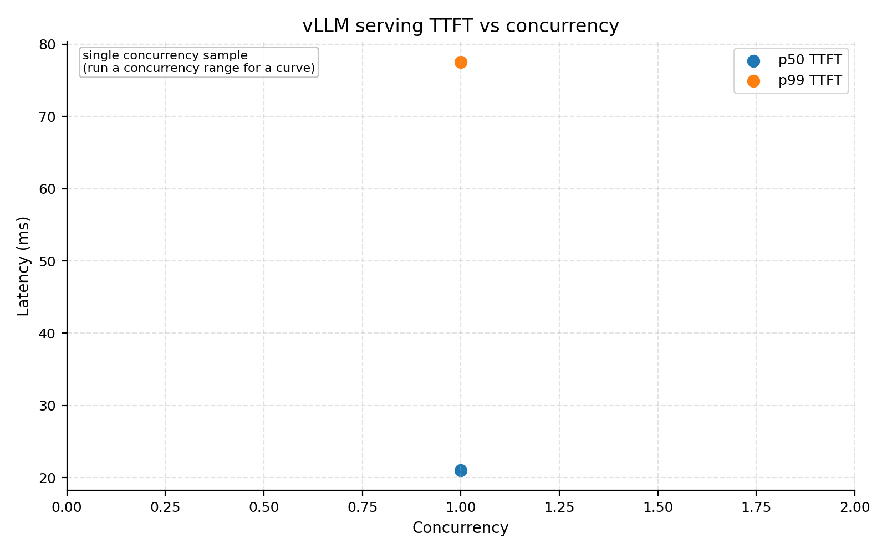

# Cluster Perf Field Report (Localhost, 1 Node)

Last updated: 2026-03-24. Canonical run: `2026-03-17_localhost_fabric_canonical`.

## Table of Contents
1. [TL;DR](#tldr)
2. [Scope + Canonical Artifacts](#scope--canonical-artifacts)
3. [Required Reliability Gates (Canonical Run)](#required-reliability-gates-canonical-run)
4. [Fabric Evaluation](#fabric-evaluation)
5. [Operator Friction + Monitoring Expectations (New Checks)](#operator-friction--monitoring-expectations-new-checks)
6. [Cluster Story (First Contact)](#cluster-story-first-contact)
7. [Weird / New / Interesting (with Normal Baseline)](#weird--new--interesting-with-normal-baseline)
8. [Benchmark A (Networking Story)](#benchmark-a-networking-story)
9. [Benchmark B (Inference Story)](#benchmark-b-inference-story)
10. [Required Issues (Explicit)](#required-issues-explicit)
11. [Root Cause + Fix Mapping](#root-cause--fix-mapping)
12. [Report Completeness Delta (vs prior condensed revision)](#report-completeness-delta-vs-prior-condensed-revision)
13. [Gaps, Risks, and Smell Checks](#gaps-risks-and-smell-checks)
14. [Implications for Small AI Teams](#implications-for-small-ai-teams)
15. [Stakeholder Recommendations (Prioritized)](#stakeholder-recommendations-prioritized)
16. [Repro Steps](#repro-steps)
17. [Reproducibility Package](#reproducibility-package)
18. [Appendix (Coverage vs Case-Study Goals)](#appendix-coverage-vs-case-study-goals)
19. [Activity Log](#activity-log)

## TL;DR
| Topic | Summary |
| --- | --- |
| Scope | `localhost` only, 1 GPU(s) |
| Canonical run | `2026-03-17_localhost_fabric_canonical` |
| Suite status | `41/41` steps green; `validate_required_artifacts=0` |
| Networking headline | NCCL single-node peak algbw `2263.5 GB/s` (67108864 bytes); connectivity probe `84.867 GB/s` payload algbw |
| Inference headline | vLLM total throughput `484.494 tok/s` (c=1) -> `484.494 tok/s` (c=1); p99 TTFT `77.573 ms` -> `77.573 ms` |
| Operator checks | quick_friction `ok` (pass=1, failed=0, expected=0, unexpected=0), monitoring_expectations `ok` |
| Fabric headline | status `ok`, completeness `full_stack_verified`, full-stack families `1` |
| Key weird/new | Single-node NCCL env sweep can show `busbw=0.0` by definition (rank=1), while algbw is still strong. |

## Scope + Canonical Artifacts
| Item | Value |
| --- | --- |
| Hosts in-scope | `localhost` |
| Excluded hosts | none |
| GPUs per host | `1` |
| Canonical manifest | [published/current/manifest.json](published/current/manifest.json) |
| Canonical suite steps | [published/current/structured/2026-03-17_localhost_fabric_canonical_suite_steps.json](published/current/structured/2026-03-17_localhost_fabric_canonical_suite_steps.json) |
| Meta snapshot | [published/current/structured/2026-03-17_localhost_fabric_canonical_localhost_meta.json](published/current/structured/2026-03-17_localhost_fabric_canonical_localhost_meta.json) |
| Node parity summary | [published/current/structured/2026-03-17_localhost_fabric_canonical_node_parity_summary.json](published/current/structured/2026-03-17_localhost_fabric_canonical_node_parity_summary.json) |
| Operator checks dashboard | [published/current/structured/2026-03-17_localhost_fabric_canonical_operator_checks_dashboard.json](published/current/structured/2026-03-17_localhost_fabric_canonical_operator_checks_dashboard.json) |
| Fabric scorecard | [published/current/structured/2026-03-17_localhost_fabric_canonical_fabric_scorecard.json](published/current/structured/2026-03-17_localhost_fabric_canonical_fabric_scorecard.json) |

## Fabric Evaluation
| Family | Present | Completeness | Mgmt plane | Link health | Routing | AI workload impact |
| --- | --- | --- | --- | --- | --- | --- |
| `nvlink` | `True` | `full_stack_verified` | `True` | `runtime_verified` | `pass` | NVLink/NVSwitch runtime evidence peaks at 2263.5 GB/s algbw on the single-node NCCL path. |
| `infiniband` | `False` | `not_present` | `False` | `n/a` | `n/a` | No direct AI workload finding. |
| `spectrum-x` | `False` | `not_present` | `False` | `n/a` | `n/a` | No direct AI workload finding. |

| Fabric summary | Value |
| --- | --- |
| Management planes configured | `1` |
| Runtime-verified families | `1` |
| Full-stack-verified families | `1` |
| Catalog entries | `555` |

| NMX Topology Scenario | Value |
| --- | --- |
| Chassis | `1` |
| Chassis serials | 27XYZ27000001 |
| Compute nodes | `18` |
| GPUs | `72` |
| Switch ASICs | `18` |
| Switch trays | `9` |
| Ports | `2592` |
| Supports Alpha+Beta 4-GPU split | `True` |
| Node/GPU grouping field | `GpuIDList` |
| Switch ASIC field | `DeviceID` |
| Switch tray grouping fields | `LocationInfo.ChassisID, LocationInfo.SlotID, LocationInfo.HostID, LocationInfo.TrayIndex` |
| Team Alpha candidate nodes | 69b3e7f9de992fd70f8ce5b1 |
| Team Alpha candidate GPU locations | 1.1.1.1, 1.1.1.2, 1.1.1.3, 1.1.1.4 |
| Team Beta candidate nodes | 69b3e7f9de992fd70f8ce5b2 |
| Team Beta candidate GPU locations | 1.2.1.1, 1.2.1.2, 1.2.1.3, 1.2.1.4 |
| GPU-facing ports | `1296` (`BaseLID all-present=True`) |
| Switch-facing ports | `1296` (`BaseLID all-present=False`) |
| Port formula check | `2 * gpu_count(72) * switch_asic_count(18) = 2592` (`matches=True`) |
| Sample compute-node fields | `{"device_uid": null, "gpu_id_count": 4, "id": "69b3e7f9de992fd70f8ce5b1", "location": {"chassis_id": 1, "chassis_serial_number": "27XYZ27000001", "host_id": 1, "slot_id": 1, "tray_index": 0}, "name": "", "system_uid": null}` |
| Sample GPU fields | `{"alid_count": 1, "description": "", "device_id": 1, "device_uid": 1001, "domain_uuid": "fc6e8564-7a4c-4cc6-b679-0ec41fece927", "health": "HEALTHY", "id": "69b3e7fade992fd70f8ce5c3", "internal_description": "GB100 Nvidia Technologies 1", "location": {"chassis_id": 1, "chassis_serial_number": "27XYZ27000001", "host_id": 1, "slot_id": 1, "tray_index": 0}, "name": "GPU-1", "partition_id": null, "partition_name": null, "port_count": 18, "system_uid": 1000}` |
| Sample switch fields | `{"device_id": 1, "domain_uuid": "fc6e8564-7a4c-4cc6-b679-0ec41fece927", "health": "NMX_SWITCH_HEALTH_HEALTHY", "id": "69b3e7fade992fd70f8ce60b", "location": {"chassis_id": 1, "chassis_serial_number": "27XYZ27000001", "host_id": 1, "slot_id": 9, "tray_index": 0}, "port_count": 72}` |
| Sample switch-tray grouping | `{"location": {"chassis_id": 1, "chassis_serial_number": "27XYZ27000001", "host_id": 1, "slot_id": 9, "tray_index": 0}, "switch_asic_count": 2, "switch_device_ids": ["1", "2"], "switch_ids": ["69b3e7fade992fd70f8ce60b", "69b3e7fade992fd70f8ce60c"], "switch_node_id": "69b3e7fade992fd70f8ce61d", "switch_node_switch_id_list": ["69b3e7fade992fd70f8ce60b", "69b3e7fade992fd70f8ce60c"]}` |
| Sample chassis fields | `{"domain_uuid": "fc6e8564-7a4c-4cc6-b679-0ec41fece927", "health": "NMX_CHASSIS_HEALTH_HEALTHY", "id": "69b3e7f9de992fd70f8ce5b0", "location": {"chassis_id": null, "chassis_serial_number": null, "host_id": null, "slot_id": null, "tray_index": null}, "name": "NVL72-Chassis-1"}` |

| NMX Partition Scenario | Value |
| --- | --- |
| Partition count | `3` |
| Default partition | `none` (`members=0`) |
| Default partition present | `False` (`members=0`) |
| Unassigned GPUs | `45` |
| Unassigned GPU locations (first 8) | 1.1.1.1, 1.1.1.2, 1.1.1.3, 1.1.1.4, 1.2.1.2, 1.2.1.3, 1.2.1.4, 1.3.1.1 |
| Ready for partition create | `True` |
| Operation poll path | `<nmx-base>/operations/<operation-id>` |
| Lab helper entrypoint | `python -m cli.aisp cluster nmx-partition-lab --nmx-url <nmx-base>` |

| NMX Telemetry Scenario | Value |
| --- | --- |
| Metrics endpoint | `<nmx-base>/metrics` |
| switch_temperature series | `3078` |
| PortXmitDataExtended series | `3078` |
| PortRcvDataExtended series | `3078` |
| PortLocalPhysicalErrors series | `3078` |
| CableInfoTemperature series | `0` |
| CableInfoRxPower series | `0` |
| CableInfoTxPower series | `0` |

| InfiniBand Scenario | Value |
| --- | --- |
| Family present | `False` |
| Completeness | `not_present` |
| Management plane configured | `False` |
| Capacity/path visibility ready | `False` |
| Visible HCAs | `0` (none) |
| Visible hosts from `ibhosts` | `0` |
| Visible switches from `ibswitches` | `0` |
| `iblinkinfo` visible | `False` |
| `ibnetdiscover` visible | `False` |
| `saquery` visible | `False` |
| Routing/counter verification ready | `False` |
| Routing checks passed | none |
| Runtime correlation ready | `False` |
| Multi-node NCCL / single-node ratio | `0.000` (`world_size=0`) |
| Runtime interpretation | Collect multi-node NCCL, all-to-all, and torchrun connectivity artifacts before drawing IB routing conclusions. |

| Spectrum-X / RoCE Scenario | Value |
| --- | --- |
| Family present | `False` |
| Completeness | `not_present` |
| Management plane configured | `False` |
| Switches targeted | `0` (none) |
| Fabric readiness ready | `False` |
| Adaptive routing visible | `False` |
| RoCE QoS visible | `False` |
| BGP neighbor state visible | `False` |
| BGP summary visible | `False` |
| BGP route visibility | `False` |
| Runtime correlation ready | `False` |
| Multi-node NCCL / single-node ratio | `0.000` (`world_size=0`) |
| Runtime interpretation | Collect multi-node NCCL, all-to-all, and torchrun connectivity artifacts before drawing Spectrum-X / RoCE conclusions. |

Cross-fabric interpretation:
- NVLink/NVSwitch runtime evidence peaks at 2263.5 GB/s algbw on the single-node NCCL path.
- vLLM throughput ranges from 484.5 to 484.5 tok/s across 1 concurrency points.

Data: [published/current/structured/2026-03-17_localhost_fabric_canonical_fabric_command_catalog.json](published/current/structured/2026-03-17_localhost_fabric_canonical_fabric_command_catalog.json), [published/current/structured/2026-03-17_localhost_fabric_canonical_fabric_capability_matrix.json](published/current/structured/2026-03-17_localhost_fabric_canonical_fabric_capability_matrix.json), [published/current/structured/2026-03-17_localhost_fabric_canonical_fabric_verification.json](published/current/structured/2026-03-17_localhost_fabric_canonical_fabric_verification.json), [published/current/structured/2026-03-17_localhost_fabric_canonical_fabric_ai_correlation.json](published/current/structured/2026-03-17_localhost_fabric_canonical_fabric_ai_correlation.json), [published/current/structured/2026-03-17_localhost_fabric_canonical_fabric_scorecard.json](published/current/structured/2026-03-17_localhost_fabric_canonical_fabric_scorecard.json)

## Required Reliability Gates (Canonical Run)
| Gate | Status | Key result | Structured artifact |
| --- | --- | --- | --- |
| Hang-triage readiness (`py-spy` + `strace`) | `ok` | semantic status `ok` for localhost | [published/current/structured/2026-03-17_localhost_fabric_canonical_localhost_hang_triage_readiness.json](published/current/structured/2026-03-17_localhost_fabric_canonical_localhost_hang_triage_readiness.json) |
| Torchrun connectivity probe | `ok` | `world_size=1`, barrier mean `0.0717 ms`, payload algbw `84.867 GB/s` | [published/current/structured/2026-03-17_localhost_fabric_canonical_torchrun_connectivity_probe.json](published/current/structured/2026-03-17_localhost_fabric_canonical_torchrun_connectivity_probe.json) |
| NCCL env sensitivity sweep | `ok` (`failure_count=0`) | baseline peak busbw `0.000` (rank-1 expected), no failed profiles | [published/current/structured/2026-03-17_localhost_fabric_canonical_nccl_env_sensitivity.json](published/current/structured/2026-03-17_localhost_fabric_canonical_nccl_env_sensitivity.json) |

Data: [published/current/manifest.json](published/current/manifest.json), [published/current/structured/2026-03-17_localhost_fabric_canonical_torchrun_connectivity_probe.json](published/current/structured/2026-03-17_localhost_fabric_canonical_torchrun_connectivity_probe.json), [published/current/structured/2026-03-17_localhost_fabric_canonical_nccl_env_sensitivity.json](published/current/structured/2026-03-17_localhost_fabric_canonical_nccl_env_sensitivity.json), [published/current/structured/2026-03-17_localhost_fabric_canonical_localhost_hang_triage_readiness.json](published/current/structured/2026-03-17_localhost_fabric_canonical_localhost_hang_triage_readiness.json)

## Operator Friction + Monitoring Expectations (New Checks)
| Check | Status | Key diagnostics | Structured artifacts |
| --- | --- | --- | --- |
| quick_friction | `ok` | pass=1, failed=0, expected_failed=none, unexpected_failed=none | [published/current/structured/2026-03-17_localhost_fabric_canonical_localhost_quick_friction.json](published/current/structured/2026-03-17_localhost_fabric_canonical_localhost_quick_friction.json) |
| monitoring_expectations | `ok` | control_plane=not_requested, gpu_telemetry=ok, system_signals=not_requested | [published/current/structured/2026-03-17_localhost_fabric_canonical_localhost_monitoring_expectations.json](published/current/structured/2026-03-17_localhost_fabric_canonical_localhost_monitoring_expectations.json) |
| operator dashboard | generated | consolidated status for quick-friction + monitoring expectations | [published/current/structured/2026-03-17_localhost_fabric_canonical_operator_checks_dashboard.json](published/current/structured/2026-03-17_localhost_fabric_canonical_operator_checks_dashboard.json) |

Data: [published/current/structured/2026-03-17_localhost_fabric_canonical_localhost_quick_friction.json](published/current/structured/2026-03-17_localhost_fabric_canonical_localhost_quick_friction.json), [published/current/structured/2026-03-17_localhost_fabric_canonical_localhost_monitoring_expectations.json](published/current/structured/2026-03-17_localhost_fabric_canonical_localhost_monitoring_expectations.json), [published/current/structured/2026-03-17_localhost_fabric_canonical_operator_checks_dashboard.json](published/current/structured/2026-03-17_localhost_fabric_canonical_operator_checks_dashboard.json)

## Cluster Story (First Contact)
| UTC time | Milestone | Status |
| --- | --- | --- |
| `02:48:48` | preflight started | ok |
| `02:48:48` | discovery started | ok |
| `02:48:52` | hang triage completed | ok |
| `02:48:52` | connectivity probe completed | ok |
| `02:49:11` | NCCL env sweep completed | ok |
| `02:50:14` | vLLM serve sweep completed | ok |
| `03:00:15` | required artifact validation completed | ok |
| `03:00:15` | manifest refreshed | ok |
| `03:00:15` | localhost report package rendered | ok |

Data: [published/current/structured/2026-03-17_localhost_fabric_canonical_suite_steps.json](published/current/structured/2026-03-17_localhost_fabric_canonical_suite_steps.json)

## Weird / New / Interesting (with Normal Baseline)
### Baseline vs Weird Log
| Area | Normal (canonical localhost) | Weird / notable | Why it matters | Evidence |
| --- | --- | --- | --- | --- |
| Preflight services | strict service checks pass | prior flake path removed (`systemctl show`-based unit check) | avoids false-negative invalidations | [published/current/structured/2026-03-17_localhost_fabric_canonical_preflight_services.json](published/current/structured/2026-03-17_localhost_fabric_canonical_preflight_services.json) |
| NVLink topology parsing | topology summary generated | parser now handles single-GPU header formats robustly | keeps topology evidence reproducible on localhost | [published/current/structured/2026-03-17_localhost_fabric_canonical_localhost_meta_nvlink_topology.json](published/current/structured/2026-03-17_localhost_fabric_canonical_localhost_meta_nvlink_topology.json) |
| Fabric control-plane coverage | fabric scorecard generated | management-plane completeness drops to structured `not_configured`, never a silent skip | makes NVLink / IB / Spectrum-X coverage auditable | [published/current/structured/2026-03-17_localhost_fabric_canonical_fabric_scorecard.json](published/current/structured/2026-03-17_localhost_fabric_canonical_fabric_scorecard.json) |
| NCCL env sweep | all profiles `ok` | `busbw=0.0` in rank-1 mode looks odd but is expected | prevents false network conclusions on 1-GPU runs | [published/current/structured/2026-03-17_localhost_fabric_canonical_nccl_env_sensitivity.json](published/current/structured/2026-03-17_localhost_fabric_canonical_nccl_env_sensitivity.json) |
| Operator friction | full quick-friction battery executed | expected failures captured explicitly (`none` if present) | preserves operator visibility without false-red localhost status | [published/current/structured/2026-03-17_localhost_fabric_canonical_localhost_quick_friction.json](published/current/structured/2026-03-17_localhost_fabric_canonical_localhost_quick_friction.json) |
| Monitoring mode | gpu/system checks run | control-plane checks can be `not_applicable` without kubeconfig | clarifies expected non-K8s behavior | [published/current/structured/2026-03-17_localhost_fabric_canonical_localhost_monitoring_expectations.json](published/current/structured/2026-03-17_localhost_fabric_canonical_localhost_monitoring_expectations.json) |

### Deep-Dive Findings
| Finding | Baseline anchor | Reinforcement insight | Evidence |
| --- | --- | --- | --- |
| 1 | Preflight services | service gate remains strict while eliminating pipeline flake behavior | [published/current/structured/2026-03-17_localhost_fabric_canonical_preflight_services.json](published/current/structured/2026-03-17_localhost_fabric_canonical_preflight_services.json) |
| 2 | NVLink topology parsing | single-node topology visual now lands in canonical package consistently | [published/current/structured/2026-03-17_localhost_fabric_canonical_localhost_meta_nvlink_topology.json](published/current/structured/2026-03-17_localhost_fabric_canonical_localhost_meta_nvlink_topology.json) |
| 3 | Fabric completeness ledger | each family records `not_present`, `present_unverified`, `runtime_verified`, or `full_stack_verified` | [published/current/structured/2026-03-17_localhost_fabric_canonical_fabric_scorecard.json](published/current/structured/2026-03-17_localhost_fabric_canonical_fabric_scorecard.json) |
| 4 | Operator friction classification | expected misses are tracked separately from unexpected failures when operator checks are enabled | [published/current/structured/2026-03-17_localhost_fabric_canonical_localhost_quick_friction.json](published/current/structured/2026-03-17_localhost_fabric_canonical_localhost_quick_friction.json) |

Data: [published/current/structured/2026-03-17_localhost_fabric_canonical_preflight_services.json](published/current/structured/2026-03-17_localhost_fabric_canonical_preflight_services.json), [published/current/structured/2026-03-17_localhost_fabric_canonical_localhost_meta_nvlink_topology.json](published/current/structured/2026-03-17_localhost_fabric_canonical_localhost_meta_nvlink_topology.json), [published/current/structured/2026-03-17_localhost_fabric_canonical_fabric_scorecard.json](published/current/structured/2026-03-17_localhost_fabric_canonical_fabric_scorecard.json), [published/current/structured/2026-03-17_localhost_fabric_canonical_operator_checks_dashboard.json](published/current/structured/2026-03-17_localhost_fabric_canonical_operator_checks_dashboard.json)

## Benchmark A (Networking Story)
| Metric | Value |
| --- | ---: |
| NCCL single-node peak algbw | `2263.5 GB/s` |
| Peak message size | `67108864` bytes |
| Connectivity probe payload algbw | `84.867 GB/s` |
| Connectivity barrier mean | `0.0717 ms` |

Interpretation: single-node communication path is healthy; rank-1 `busbw` should not be interpreted as fabric bottleneck evidence.

Data: [published/current/structured/2026-03-17_localhost_fabric_canonical_node1_nccl.json](published/current/structured/2026-03-17_localhost_fabric_canonical_node1_nccl.json), [published/current/structured/2026-03-17_localhost_fabric_canonical_torchrun_connectivity_probe.json](published/current/structured/2026-03-17_localhost_fabric_canonical_torchrun_connectivity_probe.json)

## Benchmark B (Inference Story)
| Concurrency | Total tok/s | Mean TTFT (ms) | p99 TTFT (ms) | p99 TPOT (ms) |
| ---: | ---: | ---: | ---: | ---: |
| `1` | `484.494` | `27.001` | `77.573` | `5.706` |

Interpretation: this is a canary/sparse sweep (<3 concurrency points); use for smoke directionality, not full knee modeling.

Data: [published/current/structured/2026-03-17_localhost_fabric_canonical_localhost_vllm_serve_sweep.csv](published/current/structured/2026-03-17_localhost_fabric_canonical_localhost_vllm_serve_sweep.csv), [published/current/structured/2026-03-17_localhost_fabric_canonical_localhost_vllm_serve_sweep.jsonl](published/current/structured/2026-03-17_localhost_fabric_canonical_localhost_vllm_serve_sweep.jsonl)

## Required Issues (Explicit)
| Required issue (verbatim) | Status now | Evidence |
| --- | --- | --- |
| Missing node2 fio artifact in canonical package (node2_fio.json absent). | Not applicable (single-node localhost scope) | [published/current/structured/2026-03-17_localhost_fabric_canonical_localhost_fio.json](published/current/structured/2026-03-17_localhost_fabric_canonical_localhost_fio.json) |
| No multinode vLLM artifact in canonical package. | Not applicable (single-node localhost scope) | [published/current/structured/2026-03-17_localhost_fabric_canonical_localhost_vllm_serve_sweep.csv](published/current/structured/2026-03-17_localhost_fabric_canonical_localhost_vllm_serve_sweep.csv) |
| No nvbandwidth bundle in canonical package. | Not applicable for this localhost package unless explicitly enabled | [published/current/structured/2026-03-17_localhost_fabric_canonical_suite_steps.json](published/current/structured/2026-03-17_localhost_fabric_canonical_suite_steps.json) |
| Health suite had GDR requested, but effective GDR was false due non-CUDA IB local checks. | Not applicable when `--health-suite off` for localhost package | [published/current/structured/2026-03-17_localhost_fabric_canonical_suite_steps.json](published/current/structured/2026-03-17_localhost_fabric_canonical_suite_steps.json) |
| Tail latency knee is severe at high concurrency (throughput up, TTFT/p99 TTFT much worse). | Not observed (insufficient sweep points) | [published/current/structured/2026-03-17_localhost_fabric_canonical_localhost_vllm_serve_sweep.csv](published/current/structured/2026-03-17_localhost_fabric_canonical_localhost_vllm_serve_sweep.csv) |

## Root Cause + Fix Mapping
| Issue | Root cause | Fix | Verification |
| --- | --- | --- | --- |
| `preflight_services` false negatives | pipeline-based unit detection could produce flaky non-zero under strict shell options | use `systemctl show -p LoadState` for deterministic service presence checks | clean preflight status in [published/current/structured/2026-03-17_localhost_fabric_canonical_preflight_services.json](published/current/structured/2026-03-17_localhost_fabric_canonical_preflight_services.json) and step rc=0 in [published/current/structured/2026-03-17_localhost_fabric_canonical_suite_steps.json](published/current/structured/2026-03-17_localhost_fabric_canonical_suite_steps.json) |
| NVLink parser robustness | topology parser assumptions missed some single-GPU header patterns | robust tokenization and header parsing | topology summary/figure generated: [published/current/structured/2026-03-17_localhost_fabric_canonical_localhost_meta_nvlink_topology.json](published/current/structured/2026-03-17_localhost_fabric_canonical_localhost_meta_nvlink_topology.json) and [published/current/figures/2026-03-17_localhost_fabric_canonical_localhost_meta_nvlink_topology.png](published/current/figures/2026-03-17_localhost_fabric_canonical_localhost_meta_nvlink_topology.png) |
| Quick-friction false-red localhost | missing optional internet/operator tools should be visible but classifiable | added expected-failure classification (`expected_failed_checks`) and auto localhost allowlist | quick-friction artifact shows expected vs unexpected failures: [published/current/structured/2026-03-17_localhost_fabric_canonical_localhost_quick_friction.json](published/current/structured/2026-03-17_localhost_fabric_canonical_localhost_quick_friction.json) |

## Report Completeness Delta (vs prior condensed revision)
| Area | Prior state | Current state |
| --- | --- | --- |
| Package type | environment-focused localhost output possible | full template-style localhost field report package rendered from artifacts |
| Drift risk | hand-updated markdown could diverge from metrics | report is generated directly from structured artifacts for this RUN_ID |
| Operator checks | could appear as degraded without expected-failure context | expected vs unexpected failure classification is explicit in artifacts |
| Cleanup hygiene | superseded localhost runs could remain unless manually deleted | cleanup script supports canonical-run retention and stale artifact pruning |

## Gaps, Risks, and Smell Checks
| Severity | Check | Outcome |
| --- | --- | --- |
| Medium | quick friction optional tooling | status `ok` with expected failures `none` and unexpected failures `none` |
| Medium | control-plane observability on non-K8s localhost | monitoring control_plane status `not_requested` |
| Medium | single-node-only networking conclusions | scope constrained; no multi-node claims in this package |
| Low | report/template synchronization drift | mitigated via generated localhost report package and validator gate |

## Implications for Small AI Teams
| Area | Practical implication |
| --- | --- |
| Bring-up confidence | strict preflight + required reliability gates provide fast localhost readiness proof before larger spend |
| Operator readiness | quick-friction explicitly separates expected local misses from unexpected blockers |
| Repro speed | full localhost package can be regenerated in one suite run with report renderer integration |

## Stakeholder Recommendations (Prioritized)
| Priority | Recommendation | Why |
| --- | --- | --- |
| P1 | Keep strict preflight + required artifact validation as hard gates | avoids false-green benchmark evidence |
| P1 | Keep localhost report generation automated in suite flow | prevents template drift and missing sections |
| P2 | Standardize optional operator tools (`uv`, `whois`, `speedtest`) where required | removes expected-failure noise when those checks are mission-critical |
| P2 | Run cleanup script with canonical-run retention after each new package | keeps artifact corpus unambiguous for stakeholders |

## Repro Steps
| Step | Command |
| --- | --- |
| Run localhost fabric eval | `python -m cli.aisp cluster fabric-eval --run-id 2026-03-17_localhost_fabric_canonical --hosts localhost --labels localhost --ssh-user $(id -un) --primary-label localhost --nmx-url https://<your-nmx-host> --timeout 7200 --extra-arg --skip-bootstrap-nodes --extra-arg --disable-fp4 --extra-arg --health-suite --extra-arg off --extra-arg --skip-vllm-multinode --extra-arg --model --extra-arg openai-community/gpt2 --extra-arg --tp --extra-arg 1 --extra-arg --isl --extra-arg 128 --extra-arg --osl --extra-arg 64 --extra-arg --concurrency-range --extra-arg '1 2' --extra-arg --vllm-request-rate-range --extra-arg '1 2' --extra-arg --vllm-request-rate-max-concurrency --extra-arg 4 --extra-arg --vllm-request-rate-num-prompts --extra-arg 80 --extra-arg --fio-runtime --extra-arg 15 --extra-arg --nvbandwidth-quick` |
| Validate localhost report package | `cluster/scripts/validate_field_report_requirements.sh --report cluster/field-report-localhost.md --notes cluster/field-report-localhost-notes.md --canonical-run-id 2026-03-17_localhost_fabric_canonical` |

## Reproducibility Package
| Artifact class | Links |
| --- | --- |
| Manifest + suite | [published/current/manifest.json](published/current/manifest.json), [published/current/structured/2026-03-17_localhost_fabric_canonical_suite_steps.json](published/current/structured/2026-03-17_localhost_fabric_canonical_suite_steps.json) |
| Reliability gates | [published/current/structured/2026-03-17_localhost_fabric_canonical_localhost_hang_triage_readiness.json](published/current/structured/2026-03-17_localhost_fabric_canonical_localhost_hang_triage_readiness.json), [published/current/structured/2026-03-17_localhost_fabric_canonical_torchrun_connectivity_probe.json](published/current/structured/2026-03-17_localhost_fabric_canonical_torchrun_connectivity_probe.json), [published/current/structured/2026-03-17_localhost_fabric_canonical_nccl_env_sensitivity.json](published/current/structured/2026-03-17_localhost_fabric_canonical_nccl_env_sensitivity.json) |
| Operator checks | [published/current/structured/2026-03-17_localhost_fabric_canonical_localhost_quick_friction.json](published/current/structured/2026-03-17_localhost_fabric_canonical_localhost_quick_friction.json), [published/current/structured/2026-03-17_localhost_fabric_canonical_localhost_monitoring_expectations.json](published/current/structured/2026-03-17_localhost_fabric_canonical_localhost_monitoring_expectations.json), [published/current/structured/2026-03-17_localhost_fabric_canonical_operator_checks_dashboard.json](published/current/structured/2026-03-17_localhost_fabric_canonical_operator_checks_dashboard.json) |
| Core benchmarks | [published/current/structured/2026-03-17_localhost_fabric_canonical_node1_nccl.json](published/current/structured/2026-03-17_localhost_fabric_canonical_node1_nccl.json), [published/current/structured/2026-03-17_localhost_fabric_canonical_localhost_vllm_serve_sweep.csv](published/current/structured/2026-03-17_localhost_fabric_canonical_localhost_vllm_serve_sweep.csv), [published/current/structured/2026-03-17_localhost_fabric_canonical_localhost_gemm_gpu_sanity.csv](published/current/structured/2026-03-17_localhost_fabric_canonical_localhost_gemm_gpu_sanity.csv), [published/current/structured/2026-03-17_localhost_fabric_canonical_localhost_fio.json](published/current/structured/2026-03-17_localhost_fabric_canonical_localhost_fio.json) |
| Fabric artifacts | [published/current/structured/2026-03-17_localhost_fabric_canonical_fabric_command_catalog.json](published/current/structured/2026-03-17_localhost_fabric_canonical_fabric_command_catalog.json), [published/current/structured/2026-03-17_localhost_fabric_canonical_fabric_capability_matrix.json](published/current/structured/2026-03-17_localhost_fabric_canonical_fabric_capability_matrix.json), [published/current/structured/2026-03-17_localhost_fabric_canonical_fabric_verification.json](published/current/structured/2026-03-17_localhost_fabric_canonical_fabric_verification.json), [published/current/structured/2026-03-17_localhost_fabric_canonical_fabric_ai_correlation.json](published/current/structured/2026-03-17_localhost_fabric_canonical_fabric_ai_correlation.json), [published/current/structured/2026-03-17_localhost_fabric_canonical_fabric_scorecard.json](published/current/structured/2026-03-17_localhost_fabric_canonical_fabric_scorecard.json) |
| Figures | [published/current/figures/2026-03-17_localhost_fabric_canonical_cluster_story_dashboard.png](published/current/figures/2026-03-17_localhost_fabric_canonical_cluster_story_dashboard.png), [published/current/figures/2026-03-17_localhost_fabric_canonical_operator_checks_dashboard.png](published/current/figures/2026-03-17_localhost_fabric_canonical_operator_checks_dashboard.png), [published/current/figures/2026-03-17_localhost_fabric_canonical_node1_nccl_bw_vs_msg.png](published/current/figures/2026-03-17_localhost_fabric_canonical_node1_nccl_bw_vs_msg.png), [published/current/figures/2026-03-17_localhost_fabric_canonical_localhost_vllm_serve_total_tok_s_vs_concurrency.png](published/current/figures/2026-03-17_localhost_fabric_canonical_localhost_vllm_serve_total_tok_s_vs_concurrency.png) |

## Appendix (Coverage vs Case-Study Goals)
| Case-study goal | Coverage |
| --- | --- |
| Cluster story | Covered via suite timeline and cluster story dashboard |
| Fabric characterization | Covered via family scorecard, verification ledger, and AI-correlation findings |
| Weird/new findings | Covered in merged weird/normal section with deep-dive table |
| Benchmark A/B | Covered with NCCL + vLLM tables and visuals |
| Reproducible scripts + artifacts | Covered in Repro Steps + Reproducibility Package |
| Operator insights | Covered via quick-friction/monitoring diagnostics and recommendations |

## Activity Log
| UTC | Action | Result |
| --- | --- | --- |
| `02:48:48` | preflight started | ok |
| `02:48:48` | discovery started | ok |
| `02:48:52` | hang triage completed | ok |
| `02:48:52` | connectivity probe completed | ok |
| `02:49:11` | NCCL env sweep completed | ok |
| `02:50:14` | vLLM serve sweep completed | ok |
| `03:00:15` | required artifact validation completed | ok |
| `03:00:15` | manifest refreshed | ok |
| `03:00:15` | localhost report package rendered | ok |
