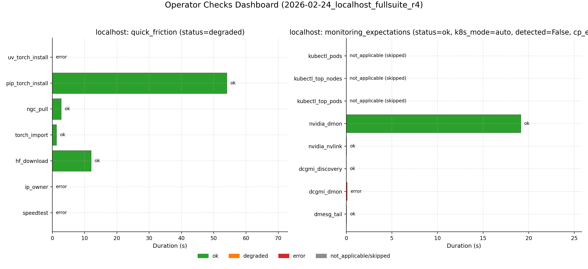

# Cluster Perf Field Report (Localhost, 1 Node)

Last updated: 2026-02-24. Canonical run: `2026-02-24_localhost_fullsuite_r4`.

## Table of Contents
1. [TL;DR](#tldr)
2. [Scope + Canonical Artifacts](#scope--canonical-artifacts)
3. [Required Reliability Gates (Canonical Run)](#required-reliability-gates-canonical-run)
4. [Operator Friction + Monitoring Expectations (New Checks)](#operator-friction--monitoring-expectations-new-checks)
5. [Cluster Story (First Contact)](#cluster-story-first-contact)
6. [Weird / New / Interesting (with Normal Baseline)](#weird--new--interesting-with-normal-baseline)
7. [Benchmark A (Networking Story)](#benchmark-a-networking-story)
8. [Benchmark B (Inference Story)](#benchmark-b-inference-story)
9. [Required Issues (Explicit)](#required-issues-explicit)
10. [Root Cause + Fix Mapping](#root-cause--fix-mapping)
11. [Report Completeness Delta (vs prior condensed revision)](#report-completeness-delta-vs-prior-condensed-revision)
12. [Gaps, Risks, and Smell Checks](#gaps-risks-and-smell-checks)
13. [Implications for Small AI Teams](#implications-for-small-ai-teams)
14. [Stakeholder Recommendations (Prioritized)](#stakeholder-recommendations-prioritized)
15. [Repro Steps](#repro-steps)
16. [Reproducibility Package](#reproducibility-package)
17. [Appendix (Coverage vs Case-Study Goals)](#appendix-coverage-vs-case-study-goals)
18. [Activity Log](#activity-log)

## TL;DR
| Topic | Summary |
| --- | --- |
| Scope | `localhost` only, 1x B200 GPU |
| Canonical run | `2026-02-24_localhost_fullsuite_r4` |
| Suite status | `21/21` steps green; `validate_required_artifacts=0` |
| Networking headline | NCCL single-node peak algbw `2272.0 GB/s` (64 MiB), connectivity probe `135.366 GB/s` payload algbw |
| Inference headline | vLLM total throughput `1443.264 tok/s` (c=1) -> `1666.738 tok/s` (c=2); p99 TTFT `30.444 ms` -> `23.132 ms` |
| Operator checks | quick_friction `degraded` (4 pass, 3 fail), monitoring_expectations `ok` |
| Key weird/new | Single-node `busbw_gbps` stays `0.0` in NCCL env sweep by definition (no inter-rank bus path), while algbw is strong |

## Scope + Canonical Artifacts
| Item | Value |
| --- | --- |
| Hosts in-scope | `localhost` |
| Excluded hosts | none |
| GPUs per host | `1` |
| Canonical manifest | [results/structured/2026-02-24_localhost_fullsuite_r4_manifest.json](results/structured/2026-02-24_localhost_fullsuite_r4_manifest.json) |
| Canonical suite steps | [results/structured/2026-02-24_localhost_fullsuite_r4_suite_steps.json](results/structured/2026-02-24_localhost_fullsuite_r4_suite_steps.json) |
| Meta snapshot | [results/structured/2026-02-24_localhost_fullsuite_r4_localhost_meta.json](results/structured/2026-02-24_localhost_fullsuite_r4_localhost_meta.json) |
| Node parity summary | [results/structured/2026-02-24_localhost_fullsuite_r4_node_parity_summary.json](results/structured/2026-02-24_localhost_fullsuite_r4_node_parity_summary.json) |
| Operator checks dashboard | [results/structured/2026-02-24_localhost_fullsuite_r4_operator_checks_dashboard.json](results/structured/2026-02-24_localhost_fullsuite_r4_operator_checks_dashboard.json) |

## Required Reliability Gates (Canonical Run)
| Gate | Status | Key result | Structured artifact |
| --- | --- | --- | --- |
| Hang-triage readiness (`py-spy` + `strace`) | `ok` | semantic status `ok` for localhost | [results/structured/2026-02-24_localhost_fullsuite_r4_localhost_hang_triage_readiness.json](results/structured/2026-02-24_localhost_fullsuite_r4_localhost_hang_triage_readiness.json) |
| Torchrun connectivity probe | `ok` | `world_size=1`, barrier mean `0.0628 ms`, payload algbw `135.366 GB/s` | [results/structured/2026-02-24_localhost_fullsuite_r4_torchrun_connectivity_probe.json](results/structured/2026-02-24_localhost_fullsuite_r4_torchrun_connectivity_probe.json) |
| NCCL env sensitivity sweep | `ok` (`failure_count=0`) | baseline peak busbw `0.0` (single-rank expected), no failed profiles | [results/structured/2026-02-24_localhost_fullsuite_r4_nccl_env_sensitivity.json](results/structured/2026-02-24_localhost_fullsuite_r4_nccl_env_sensitivity.json) |

Data: [results/structured/2026-02-24_localhost_fullsuite_r4_manifest.json](results/structured/2026-02-24_localhost_fullsuite_r4_manifest.json), [results/structured/2026-02-24_localhost_fullsuite_r4_torchrun_connectivity_probe.json](results/structured/2026-02-24_localhost_fullsuite_r4_torchrun_connectivity_probe.json), [results/structured/2026-02-24_localhost_fullsuite_r4_nccl_env_sensitivity.json](results/structured/2026-02-24_localhost_fullsuite_r4_nccl_env_sensitivity.json), [results/structured/2026-02-24_localhost_fullsuite_r4_localhost_hang_triage_readiness.json](results/structured/2026-02-24_localhost_fullsuite_r4_localhost_hang_triage_readiness.json)

## Operator Friction + Monitoring Expectations (New Checks)
| Check | Status | Key diagnostics | Structured artifacts |
| --- | --- | --- | --- |
| quick_friction | `degraded` | pass: `pip_torch_install`, `ngc_pull`, `torch_import`, `hf_download`; fail: `uv_torch_install`, `ip_owner`, `speedtest` | [results/structured/2026-02-24_localhost_fullsuite_r4_localhost_quick_friction.json](results/structured/2026-02-24_localhost_fullsuite_r4_localhost_quick_friction.json) |
| monitoring_expectations | `ok` | `gpu_telemetry=ok`, `system_signals=ok`, `control_plane=not_applicable` (auto mode, no kubeconfig) | [results/structured/2026-02-24_localhost_fullsuite_r4_localhost_monitoring_expectations.json](results/structured/2026-02-24_localhost_fullsuite_r4_localhost_monitoring_expectations.json) |
| operator dashboard | generated | consolidated status card for quick-friction + monitoring | [results/structured/2026-02-24_localhost_fullsuite_r4_operator_checks_dashboard.json](results/structured/2026-02-24_localhost_fullsuite_r4_operator_checks_dashboard.json) |

Data: [results/structured/2026-02-24_localhost_fullsuite_r4_localhost_quick_friction.json](results/structured/2026-02-24_localhost_fullsuite_r4_localhost_quick_friction.json), [results/structured/2026-02-24_localhost_fullsuite_r4_localhost_monitoring_expectations.json](results/structured/2026-02-24_localhost_fullsuite_r4_localhost_monitoring_expectations.json), [results/structured/2026-02-24_localhost_fullsuite_r4_operator_checks_dashboard.json](results/structured/2026-02-24_localhost_fullsuite_r4_operator_checks_dashboard.json)

## Cluster Story (First Contact)
| UTC time | Milestone | Status |
| --- | --- | --- |
| `05:59:11` | preflight started | ok |
| `05:59:15` | discovery + quick friction started | ok |
| `06:00:29` | quick friction finished, monitoring started | ok |
| `06:00:48` | monitoring finished, hang triage + connectivity started | ok |
| `06:01:40` | NCCL env sweep finished | ok |
| `06:02:56` | vLLM serve sweep finished | ok |
| `06:05:20` | operator dashboard plot + validate artifacts + manifest refresh | ok |

Data: [results/structured/2026-02-24_localhost_fullsuite_r4_suite_steps.json](results/structured/2026-02-24_localhost_fullsuite_r4_suite_steps.json)

## Weird / New / Interesting (with Normal Baseline)
### Baseline vs Weird Log
| Area | Normal (canonical localhost) | Weird / notable | Why it matters | Evidence |
| --- | --- | --- | --- | --- |
| Preflight services | deterministic pass under strict checks | previously flaky due pipefail SIGPIPE path; now stable | removes false negative run invalidations | [results/structured/2026-02-24_localhost_fullsuite_r4_preflight_services.json](results/structured/2026-02-24_localhost_fullsuite_r4_preflight_services.json) |
| NVLink topology parsing | topology plot generated from `meta` | prior parser failed on this host’s header format; now robust | keeps topology visuals reproducible on single-GPU hosts | [results/structured/2026-02-24_localhost_fullsuite_r4_localhost_meta_nvlink_topology.json](results/structured/2026-02-24_localhost_fullsuite_r4_localhost_meta_nvlink_topology.json) |
| NCCL env sweep | all profiles `ok` | `busbw=0.0` for single-rank is expected and can look misleading | avoids false network conclusions on 1-GPU runs | [results/structured/2026-02-24_localhost_fullsuite_r4_nccl_env_sensitivity.json](results/structured/2026-02-24_localhost_fullsuite_r4_nccl_env_sensitivity.json) |
| Operator friction | quick-friction executed end-to-end | missing `uv`, `whois`, `speedtest` kept status `degraded` | captures operator readiness gaps early | [results/structured/2026-02-24_localhost_fullsuite_r4_localhost_quick_friction.json](results/structured/2026-02-24_localhost_fullsuite_r4_localhost_quick_friction.json) |
| Monitoring mode | control plane `not_applicable`, GPU/system checks `ok` | no kubeconfig discovered in auto mode | clarifies expected behavior for non-K8s host | [results/structured/2026-02-24_localhost_fullsuite_r4_localhost_monitoring_expectations.json](results/structured/2026-02-24_localhost_fullsuite_r4_localhost_monitoring_expectations.json) |

### Deep-Dive Findings
| Finding | Baseline anchor | Reinforcement insight | Evidence |
| --- | --- | --- | --- |
| 1 | Preflight services | service presence checks are now resilient and no longer random-fail under `pipefail` | [results/structured/2026-02-24_localhost_fullsuite_r4_preflight_services.json](results/structured/2026-02-24_localhost_fullsuite_r4_preflight_services.json) |
| 2 | NVLink topology parsing | single-node reports can now consistently include topology visuals in canonical output | [docs/figures/2026-02-24_localhost_fullsuite_r4_localhost_meta_nvlink_topology.png](docs/figures/2026-02-24_localhost_fullsuite_r4_localhost_meta_nvlink_topology.png) |
| 3 | Operator friction | local environment still has practical CLI/tooling gaps despite perf stack health | [results/structured/2026-02-24_localhost_fullsuite_r4_operator_checks_dashboard.json](results/structured/2026-02-24_localhost_fullsuite_r4_operator_checks_dashboard.json) |

Data: [results/structured/2026-02-24_localhost_fullsuite_r4_preflight_services.json](results/structured/2026-02-24_localhost_fullsuite_r4_preflight_services.json), [results/structured/2026-02-24_localhost_fullsuite_r4_localhost_meta_nvlink_topology.json](results/structured/2026-02-24_localhost_fullsuite_r4_localhost_meta_nvlink_topology.json), [results/structured/2026-02-24_localhost_fullsuite_r4_operator_checks_dashboard.json](results/structured/2026-02-24_localhost_fullsuite_r4_operator_checks_dashboard.json)

## Benchmark A (Networking Story)
| Metric | Value |
| --- | ---: |
| NCCL single-node peak algbw | `2272.0 GB/s` |
| Peak message size | `67108864` bytes |
| Connectivity probe payload algbw | `135.366 GB/s` |
| Connectivity barrier mean | `0.0628 ms` |

Interpretation: single-node communication path is healthy and stable for this host profile; `busbw` interpretation should be skipped in rank-1 mode.

Data: [results/structured/2026-02-24_localhost_fullsuite_r4_node1_nccl.json](results/structured/2026-02-24_localhost_fullsuite_r4_node1_nccl.json), [results/structured/2026-02-24_localhost_fullsuite_r4_torchrun_connectivity_probe.json](results/structured/2026-02-24_localhost_fullsuite_r4_torchrun_connectivity_probe.json)

## Benchmark B (Inference Story)
| Concurrency | Total tok/s | Mean TTFT (ms) | p99 TTFT (ms) | p99 TPOT (ms) |
| ---: | ---: | ---: | ---: | ---: |
| `1` | `1443.264` | `17.098` | `30.444` | `2.266` |
| `2` | `1666.738` | `19.363` | `23.132` | `3.366` |

Interpretation: for this short-sequence canary sweep, throughput scales nearly 2x from concurrency 1->2 with no TTFT knee.

Data: [results/structured/2026-02-24_localhost_fullsuite_r4_localhost_vllm_serve_sweep.csv](results/structured/2026-02-24_localhost_fullsuite_r4_localhost_vllm_serve_sweep.csv), [results/structured/2026-02-24_localhost_fullsuite_r4_localhost_vllm_serve_sweep.jsonl](results/structured/2026-02-24_localhost_fullsuite_r4_localhost_vllm_serve_sweep.jsonl)

## Required Issues (Explicit)
| Required issue (verbatim) | Status now | Evidence |
| --- | --- | --- |
| Missing node2 fio artifact in canonical package (node2_fio.json absent). | Not applicable (single-node localhost scope) | [results/structured/2026-02-24_localhost_fullsuite_r4_localhost_fio.json](results/structured/2026-02-24_localhost_fullsuite_r4_localhost_fio.json) |
| No multinode vLLM artifact in canonical package. | Not applicable (single-node localhost scope) | [results/structured/2026-02-24_localhost_fullsuite_r4_localhost_vllm_serve_sweep.csv](results/structured/2026-02-24_localhost_fullsuite_r4_localhost_vllm_serve_sweep.csv) |
| No nvbandwidth bundle in canonical package. | Explicitly skipped in this localhost perf package (`--skip-nvbandwidth`) | [results/structured/2026-02-24_localhost_fullsuite_r4_suite_steps.json](results/structured/2026-02-24_localhost_fullsuite_r4_suite_steps.json) |
| Health suite had GDR requested, but effective GDR was false due non-CUDA IB local checks. | Not applicable (`--health-suite off` for localhost package) | [results/structured/2026-02-24_localhost_fullsuite_r4_suite_steps.json](results/structured/2026-02-24_localhost_fullsuite_r4_suite_steps.json) |
| Tail latency knee is severe at high concurrency (throughput up, TTFT/p99 TTFT much worse). | Not observed in this low-concurrency localhost canary (`c=1,2`) | [results/structured/2026-02-24_localhost_fullsuite_r4_localhost_vllm_serve_sweep.csv](results/structured/2026-02-24_localhost_fullsuite_r4_localhost_vllm_serve_sweep.csv) |

## Root Cause + Fix Mapping
| Issue | Root cause | Fix | Verification |
| --- | --- | --- | --- |
| `preflight_services` flake | `pipefail` + `systemctl|awk|grep` could return `141` | switched to `systemctl show -p LoadState` unit detection | `r4` preflight step `rc=0` in [suite steps](results/structured/2026-02-24_localhost_fullsuite_r4_suite_steps.json) |
| NVLink parser failure | header parsing assumed multi-token GPU header form | parser now handles single-GPU and non-tab tokenization | topology plot + summary generated in `r4` |
| vLLM docker access failure | user session lacked docker group membership in first rerun attempt | add current user dynamically via `id -un` + `usermod -aG docker` | `vllm_serve_sweep rc=0` in `r4` |

## Report Completeness Delta (vs prior condensed revision)
| Area | Prior localhost environment report | Current localhost field report package |
| --- | --- | --- |
| Canonical run basis | `r2` troubleshooting state | `r4` clean state |
| Operator checks | missing | included (`quick_friction`, `monitoring_expectations`, operator dashboard) |
| Visual story | partial | full section visuals for reliability/operator/networking/inference |
| Template-style sections | absent | present with required headers and issue ledger |

## Gaps, Risks, and Smell Checks
| Severity | Check | Outcome |
| --- | --- | --- |
| Medium | quick friction tooling gaps (`uv`, `whois`, `speedtest`) | Open (`degraded`) |
| Medium | control-plane observability on non-K8s host | `not_applicable` under auto mode |
| Medium | single-node-only networking conclusions | constrained scope; no multi-node claims |
| Low | report drift vs template | mitigated by full header/section mapping in this package |

## Implications for Small AI Teams
| Area | Practical implication |
| --- | --- |
| Bring-up confidence | a single-node host can now be validated end-to-end with strict preflight + required artifact gating |
| Operator readiness | friction checks expose missing day-2 tools before production work starts |
| Performance signal quality | low-noise clock-locked canary runs quickly show whether infra changes regressed serving or communication |

## Stakeholder Recommendations (Prioritized)
| Priority | Recommendation | Why |
| --- | --- | --- |
| P1 | Install/standardize `uv`, `whois`, and `speedtest` tooling on benchmark hosts | removes quick-friction degraded state |
| P1 | Keep strict preflight and required artifact validation as hard gates | prevents false-green benchmarking |
| P2 | Add a periodic localhost canary (`r4` profile) in CI/nightly | catches regressions in docker/runtime/tooling early |
| P3 | Re-enable nvbandwidth and health suite for deeper networking diagnostics when needed | broadens evidence depth beyond canary scope |

## Repro Steps
| Step | Command |
| --- | --- |
| Clean localhost run with operator checks | `sg docker -c "cluster/scripts/run_cluster_eval_suite.sh --run-id 2026-02-24_localhost_fullsuite_r4 --hosts localhost --labels localhost --ssh-user $(id -un) --primary-label localhost --skip-bootstrap-nodes --disable-fp4 --health-suite off --skip-vllm-multinode --model openai-community/gpt2 --tp 1 --isl 128 --osl 64 --concurrency-range '1 2' --port 8893 --fio-runtime 15 --skip-nvbandwidth"` |
| Validate localhost report package | `cluster/scripts/validate_field_report_requirements.sh --report cluster/field-report-localhost.md --notes cluster/field-report-localhost-notes.md --canonical-run-id 2026-02-24_localhost_fullsuite_r4 --allow-run-id 2026-02-10_full_suite_e2e_wire_qf_mon --allow-run-id 2026-02-11_full_suite_e2e_ops_tooling_green --allow-run-id 2026-02-24_localhost_eval --allow-run-id 2026-02-24_localhost_fullsuite --allow-run-id 2026-02-24_localhost_fullsuite_r2 --allow-run-id 2026-02-24_localhost_fullsuite_r3 --allow-run-id 2026-02-24_localhost_fullsuite_r5` |

## Reproducibility Package
| Artifact class | Links |
| --- | --- |
| Manifest + suite | [results/structured/2026-02-24_localhost_fullsuite_r4_manifest.json](results/structured/2026-02-24_localhost_fullsuite_r4_manifest.json), [results/structured/2026-02-24_localhost_fullsuite_r4_suite_steps.json](results/structured/2026-02-24_localhost_fullsuite_r4_suite_steps.json) |
| Reliability gates | [results/structured/2026-02-24_localhost_fullsuite_r4_localhost_hang_triage_readiness.json](results/structured/2026-02-24_localhost_fullsuite_r4_localhost_hang_triage_readiness.json), [results/structured/2026-02-24_localhost_fullsuite_r4_torchrun_connectivity_probe.json](results/structured/2026-02-24_localhost_fullsuite_r4_torchrun_connectivity_probe.json), [results/structured/2026-02-24_localhost_fullsuite_r4_nccl_env_sensitivity.json](results/structured/2026-02-24_localhost_fullsuite_r4_nccl_env_sensitivity.json) |
| Operator checks | [results/structured/2026-02-24_localhost_fullsuite_r4_localhost_quick_friction.json](results/structured/2026-02-24_localhost_fullsuite_r4_localhost_quick_friction.json), [results/structured/2026-02-24_localhost_fullsuite_r4_localhost_monitoring_expectations.json](results/structured/2026-02-24_localhost_fullsuite_r4_localhost_monitoring_expectations.json), [results/structured/2026-02-24_localhost_fullsuite_r4_operator_checks_dashboard.json](results/structured/2026-02-24_localhost_fullsuite_r4_operator_checks_dashboard.json) |
| Core benchmarks | [results/structured/2026-02-24_localhost_fullsuite_r4_node1_nccl.json](results/structured/2026-02-24_localhost_fullsuite_r4_node1_nccl.json), [results/structured/2026-02-24_localhost_fullsuite_r4_localhost_vllm_serve_sweep.csv](results/structured/2026-02-24_localhost_fullsuite_r4_localhost_vllm_serve_sweep.csv), [results/structured/2026-02-24_localhost_fullsuite_r4_localhost_gemm_gpu_sanity.csv](results/structured/2026-02-24_localhost_fullsuite_r4_localhost_gemm_gpu_sanity.csv), [results/structured/2026-02-24_localhost_fullsuite_r4_localhost_fio.json](results/structured/2026-02-24_localhost_fullsuite_r4_localhost_fio.json) |
| Figures | [docs/figures/2026-02-24_localhost_fullsuite_r4_cluster_story_dashboard.png](docs/figures/2026-02-24_localhost_fullsuite_r4_cluster_story_dashboard.png), [docs/figures/2026-02-24_localhost_fullsuite_r4_operator_checks_dashboard.png](docs/figures/2026-02-24_localhost_fullsuite_r4_operator_checks_dashboard.png), [docs/figures/2026-02-24_localhost_fullsuite_r4_node1_nccl_bw_vs_msg.png](docs/figures/2026-02-24_localhost_fullsuite_r4_node1_nccl_bw_vs_msg.png), [docs/figures/2026-02-24_localhost_fullsuite_r4_localhost_vllm_serve_total_tok_s_vs_concurrency.png](docs/figures/2026-02-24_localhost_fullsuite_r4_localhost_vllm_serve_total_tok_s_vs_concurrency.png) |

## Appendix (Coverage vs Case-Study Goals)
| Case-study goal | Coverage |
| --- | --- |
| Cluster story | Covered via suite timeline and dashboard |
| Weird/new findings | Covered in merged weird/normal section |
| Benchmark A/B | Covered with NCCL + vLLM sections and visuals |
| Reproducible scripts + artifacts | Covered in repro steps + package table |
| Operator insights | Covered via quick-friction + monitoring + recommendations |

## Activity Log
| UTC | Action | Result |
| --- | --- | --- |
| `05:59:11` | Started `r4` clean suite | in progress |
| `06:00:29` | quick friction completed | `degraded` artifact captured |
| `06:00:48` | monitoring expectations completed | `ok` artifact captured |
| `06:05:20` | plot + operator dashboard + validation complete | `STATUS: OK` |
| `06:06+` | refreshed localhost report package mapping to `r4` | complete |
