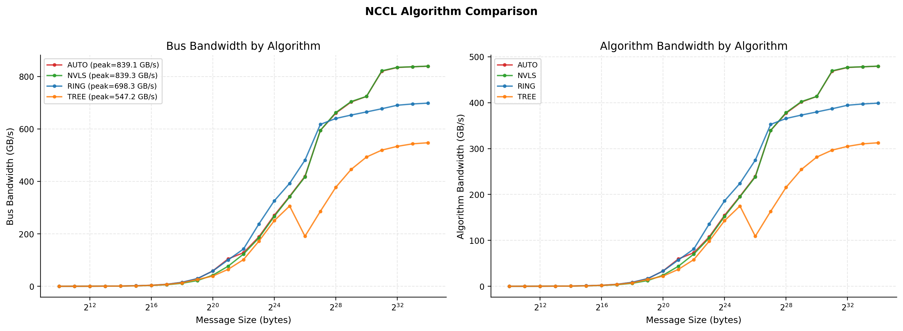
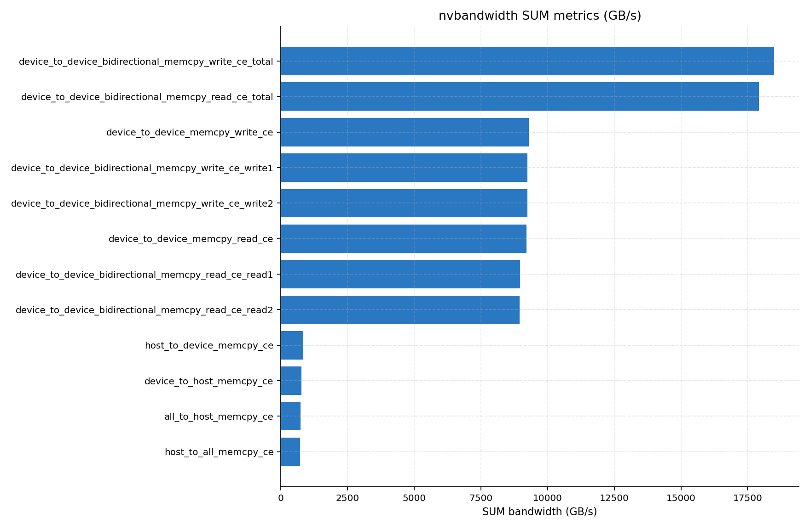
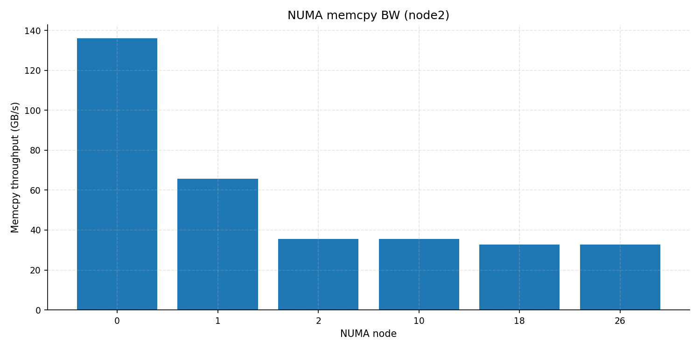
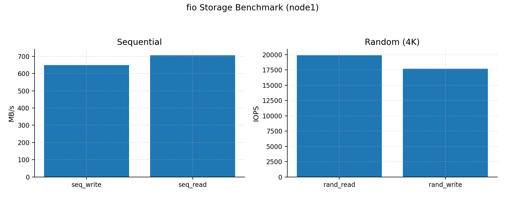
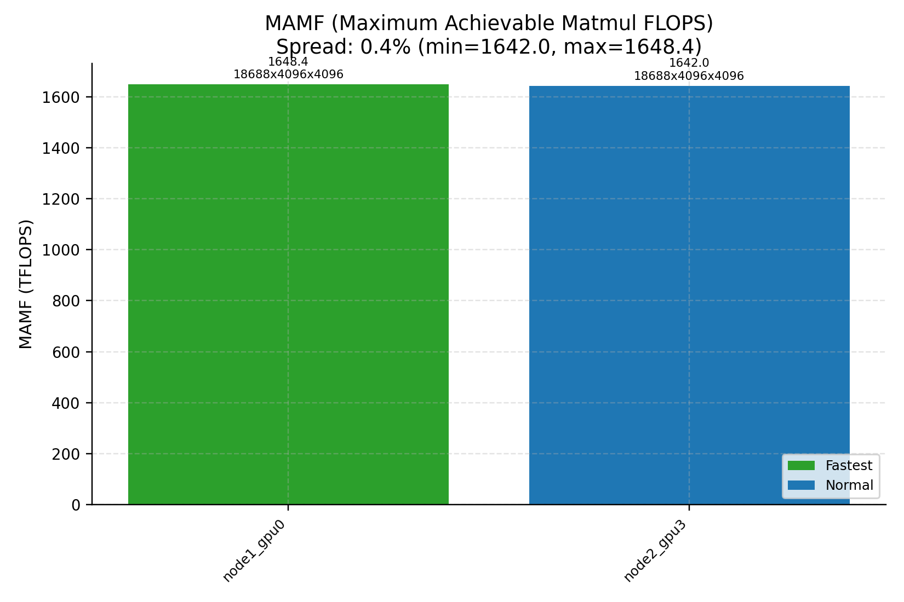

# Cluster Perf Field Report (GB200, 2 Nodes)

Last updated: 2026-02-09.

## Table of Contents
1. [TL;DR](#tldr)
2. [TL;DR Evidence Anchors](#tldr-evidence-anchors)
3. [Cluster Story (First Contact)](#cluster-story-first-contact)
4. [Normal vs Weird Log](#normal-vs-weird-log)
5. [Benchmark A (Networking Story)](#benchmark-a-networking-story)
6. [Benchmark B (Inference Story)](#benchmark-b-inference-story)
7. [Node Parity Snapshot (node1 vs node2)](#node-parity-snapshot-node1-vs-node2)
8. [NVLink/NVSwitch Topology Snapshot](#nvlinknvswitch-topology-snapshot)
9. [Dedicated nvbandwidth Snapshot](#dedicated-nvbandwidth-snapshot)
10. [GB200-Focused Extensions (Enabled in this run)](#gb200-focused-extensions-enabled-in-this-run)
11. [Weird / New / Interesting Findings](#weird--new--interesting-findings)
12. [Implications For Small AI Teams](#implications-for-small-ai-teams)
13. [Stakeholder Recommendations (Prioritized)](#stakeholder-recommendations-prioritized)
14. [Capability Demonstration (Causal Debugging Workflow)](#capability-demonstration-causal-debugging-workflow)
15. [FP4/Harness Patchset](#fp4harness-patchset)
16. [Repro Steps](#repro-steps)
17. [`--disable-fp4` if needed](#disable-fp4-if-needed)
18. [Local Patch Prerequisite (for FP4-Enabled Repro)](#local-patch-prerequisite)
19. [Reproducibility Package](#reproducibility-package)
20. [Repository Handoff (GitHub)](#repository-handoff-github)
21. [Appendix](#appendix)
22. [Activity Log](#activity-log)

## TL;DR
| Topic | Summary |
| --- | --- |
| Scope | In scope hosts: `node1`, `node2` (2 nodes); 4x GB200 per node (8 total); excluded nodes: none. |
| Canonical run | Baseline run for stakeholder conclusions: `2026-02-09_gb200_fullflags_all_0117`. |
| NCCL headline | Latest clean 2-node run is healthy and reproducible: NCCL all-reduce peak bus bandwidth `840.07 GB/s` (16 GiB), NVLS not degraded. |
| vLLM single-node headline | Throughput rises to `26.88k tok/s` at concurrency `512`, but mean TTFT grows to `~5479 ms` (clear latency knee). |
| vLLM multinode headline | Multi-node serving path is passing with strict lock evidence on both nodes: `8.24 req/s`, `2110.43 tok/s`, `p99 TTFT 938.02 ms`. |
| NVLink/NVSwitch | Topology artifacts are bundled for both nodes and show full intra-node `NV18` mesh connectivity. |
| nvbandwidth | Dedicated strict-lock bundle is included for both nodes; peak bidirectional D2D SUM is `18500.33 GB/s` (node1) and `18498.54 GB/s` (node2). |
| OOB vs IB | OOB TCP is only `~7.72/7.53 Gbps` (fwd/rev), so it should remain control/bootstrap only. |
| Transient anomalies | One-off GPU degradations and GEMM collapses were transient: either reset-fixed or self-cleared on immediate locked rerun. |
| Service policy | DCGM is now hard-required during preflight with before/after state captured per host. |
| Incident retention | Historical incident evidence is retained only where it changes operator recommendations. |
| Upstreaming | GB200-focused harness updates are now maintained in this public harness with host-native defaults and optional open container runtime. |

## TL;DR Evidence Anchors

### Scope + Baseline Package
Data: [results/structured/2026-02-09_gb200_fullflags_all_0117_manifest.json](results/structured/2026-02-09_gb200_fullflags_all_0117_manifest.json)<br/>[latest_cluster_meta][latest_cluster_meta]

### NCCL Health + NVLS Behavior
<p><a href="docs/figures/2026-02-09_gb200_fullflags_all_0117_2nodes_nccl_bw_vs_msg.png"></a></p>
<p><a href="docs/figures/2026-02-09_gb200_fullflags_all_0117_nccl_algo_comparison.png"></a></p>

Data: [health summary](results/structured/2026-02-09_gb200_fullflags_all_0117_health_suite_extended_node1node2_cluster_health_suite_summary.json)<br/>[algorithm comparison](results/structured/2026-02-09_gb200_fullflags_all_0117_nccl_algo_comparison.json)

### Inference Latency Knee
<p><a href="docs/figures/2026-02-09_gb200_fullflags_all_0117_node1_vllm_serve_total_tok_s_vs_concurrency.png"></a></p>
<p><a href="docs/figures/2026-02-09_gb200_fullflags_all_0117_node1_vllm_serve_ttft_vs_concurrency.png"></a></p>

Data: [serve sweep CSV](results/structured/2026-02-09_gb200_fullflags_all_0117_node1_vllm_serve_sweep.csv)<br/>[serve sweep JSONL](results/structured/2026-02-09_gb200_fullflags_all_0117_node1_vllm_serve_sweep.jsonl)

### Multinode vLLM Path Status
<p><a href="docs/figures/2026-02-09_gb200_fullflags_all_0117_node1_multinode_vllm_serve_total_tok_s_vs_concurrency.png"></a></p>
<p><a href="docs/figures/2026-02-09_gb200_fullflags_all_0117_node1_multinode_vllm_serve_ttft_vs_concurrency.png"></a></p>

Data: [multinode structured result](results/structured/2026-02-09_gb200_fullflags_all_0117_node1_vllm_multinode_serve.json)<br/>[multinode CSV](results/structured/2026-02-09_gb200_fullflags_all_0117_node1_vllm_multinode_serve.csv)

### NVLink/NVSwitch Topology Artifacts
<p><a href="docs/figures/2026-02-09_gb200_fullflags_all_0117_node1_nvlink_topology.png"></a></p>
<p><a href="docs/figures/2026-02-09_gb200_fullflags_all_0117_node2_nvlink_topology.png"></a></p>

Data: [node1 topology summary](results/structured/2026-02-09_gb200_fullflags_all_0117_node1_nvlink_topology.json)<br/>[node2 topology summary](results/structured/2026-02-09_gb200_fullflags_all_0117_node2_nvlink_topology.json)

### nvbandwidth Bundle Artifacts
<p><a href="docs/figures/2026-02-09_gb200_fullflags_all_0117_node1_nvbandwidth_sums.png"></a></p>
<p><a href="docs/figures/2026-02-09_gb200_fullflags_all_0117_node2_nvbandwidth_sums.png"></a></p>

Data: [node1 nvbandwidth JSON](results/structured/2026-02-09_gb200_fullflags_all_0117_node1_nvbandwidth.json)<br/>[node2 nvbandwidth JSON](results/structured/2026-02-09_gb200_fullflags_all_0117_node2_nvbandwidth.json)<br/>[node1 sums CSV](results/structured/2026-02-09_gb200_fullflags_all_0117_node1_nvbandwidth_sums.csv)<br/>[node2 sums CSV](results/structured/2026-02-09_gb200_fullflags_all_0117_node2_nvbandwidth_sums.csv)

### OOB vs IB Gap
<p><a href="docs/figures/2026-02-09_gb200_fullflags_all_0117_iperf3_oob_tcp.png"></a></p>

Data: [iperf3 OOB JSON](results/structured/2026-02-09_gb200_fullflags_all_0117_iperf3_oob_tcp.json)<br/>[NCCL health summary](results/structured/2026-02-09_gb200_fullflags_all_0117_health_suite_extended_node1node2_cluster_health_suite_summary.json)

### Transient Anomaly Evidence (Kept as Incident Context)
<p><a href="docs/figures/2026-02-08_node2_gpu2_transient_gemm_tflops.png"></a></p>

Data: [anomalous run CSV](results/structured/2026-02-08_ssh_key_full_suite_r2_node2_gemm_gpu_sanity.csv)<br/>[rerun CSV](results/structured/2026-02-08_node2_gpu2_diag_pre_reset_node2_gemm_gpu_sanity.csv)<br/>[clean baseline CSV](results/structured/2026-02-09_gb200_fullflags_all_0117_node2_gemm_gpu_sanity.csv)

### Preflight/DCGM Policy Evidence
<p><a href="docs/figures/2026-02-08_operator_state_snapshot.png"></a></p>

Data: [latest preflight](results/structured/2026-02-09_gb200_fullflags_all_0117_preflight_services.json)<br/>[historical before/after](results/structured/2026-02-08_test_preflight_dcgm_before_after_node1node2_preflight_services.json)

## Cluster Story (First Contact)
| UTC time | Milestone |
| --- | --- |
| `01:16:36` | bootstrap completed on both nodes |
| `01:16:40` | strict preflight completed (`persistenced`/`imex`/`dcgm` checks) |
| `01:17:22` | first clean 2-node NCCL run completed |
| `01:20:09` | extended health suite finished |
| `01:34:13` | first full vLLM concurrency sweep completed |
| `01:50:22` | final manifest refresh completed |

Time-to-first-multi-node-signal was short (`~1 minute` from preflight completion to first 2-node NCCL completion) because interface pinning and service policy were already codified in the harness.
Cluster behavior is HPC-flavored: strong IB/NCCL with weak OOB TCP.
Largest first-contact friction points were operational (service readiness, launch hygiene, and queue discipline), not kernel-level.

Story evidence bundle:
<p><a href="docs/figures/2026-02-09_gb200_fullflags_all_0117_cluster_story_dashboard.png"></a></p>
<p><a href="docs/figures/2026-02-08_operator_state_snapshot.png"></a></p>

Data: [health summary](results/structured/2026-02-09_gb200_fullflags_all_0117_health_suite_extended_node1node2_cluster_health_suite_summary.json)<br/>[preflight](results/structured/2026-02-09_gb200_fullflags_all_0117_preflight_services.json)<br/>[node parity summary](results/structured/2026-02-09_gb200_fullflags_all_0117_node_parity_summary.json)

## Normal vs Weird Log
| Area | Normal (clean baseline) | Weird (incident / edge case) | Evidence |
| --- | --- | --- | --- |
| NCCL multi-node | all-reduce peak `840.07 GB/s` with stable curve shape | historical low-band regime `~529.64 GB/s` | [latest_health][latest_health]<br/>[results/structured/2026-02-07_224500_nccl_16g_baseline_ppr4_bindnone_node1node2_cluster_health_suite_summary.json](results/structured/2026-02-07_224500_nccl_16g_baseline_ppr4_bindnone_node1node2_cluster_health_suite_summary.json) |
| Service state | preflight enforces `persistenced`/`imex`/`dcgm` healthy before run | missing service readiness broke NVLS init and vLLM startup | [preflight_latest][preflight_latest]<br/>[results/structured/2026-02-08_025442_cloud_eval_full_health_suite_extended_node1node2_nccl_all_reduce_perf.error_excerpt.txt](results/structured/2026-02-08_025442_cloud_eval_full_health_suite_extended_node1node2_nccl_all_reduce_perf.error_excerpt.txt)<br/>[results/structured/2026-02-08_025442_cloud_eval_full_node1_vllm_serve_sweep_sweep_log.txt](results/structured/2026-02-08_025442_cloud_eval_full_node1_vllm_serve_sweep_sweep_log.txt) |
| Inference serving | predictable throughput rise through `c=256` | strong TTFT knee at `c=512` (`~5479 ms`) | [results/structured/2026-02-09_gb200_fullflags_all_0117_node1_vllm_serve_sweep.csv](results/structured/2026-02-09_gb200_fullflags_all_0117_node1_vllm_serve_sweep.csv)<br/>[tok_s_vs_conc][tok_s_vs_conc]<br/>[ttft_vs_conc][ttft_vs_conc] |
| Inference serving (multi-node path) | harness path now executes with strict lock metadata on both hosts and digest-pinned image parity | first attempt failed on image mismatch, but latest run is healthy (`status=ok`) with TP=8 across `node1,node2` | [results/structured/2026-02-09_gb200_fullflags_all_0117_node1_vllm_multinode_serve.json](results/structured/2026-02-09_gb200_fullflags_all_0117_node1_vllm_multinode_serve.json)<br/>[docs/figures/2026-02-09_gb200_fullflags_all_0117_node1_multinode_vllm_serve_total_tok_s_vs_concurrency.png](docs/figures/2026-02-09_gb200_fullflags_all_0117_node1_multinode_vllm_serve_total_tok_s_vs_concurrency.png) |
| GEMM per-GPU | `node2_gpu2` in-family (`~1530.80 TFLOPS`) in clean baseline | one-off collapse (`~709 TFLOPS`) that recovered on immediate rerun (`~1548.7 TFLOPS`) | [results/structured/2026-02-09_gb200_fullflags_all_0117_node2_gemm_gpu_sanity.csv](results/structured/2026-02-09_gb200_fullflags_all_0117_node2_gemm_gpu_sanity.csv)<br/>[results/structured/2026-02-08_ssh_key_full_suite_r2_node2_gemm_gpu_sanity.csv](results/structured/2026-02-08_ssh_key_full_suite_r2_node2_gemm_gpu_sanity.csv)<br/>[results/structured/2026-02-08_node2_gpu2_diag_pre_reset_node2_gemm_gpu_sanity.csv](results/structured/2026-02-08_node2_gpu2_diag_pre_reset_node2_gemm_gpu_sanity.csv) |

### Visual Evidence (Normal vs Weird)
#### NCCL multi-node regime
<p><a href="docs/figures/2026-02-07_nccl_allreduce_bimodal_overlay.png"></a></p>

Data: [latest health](results/structured/2026-02-09_gb200_fullflags_all_0117_health_suite_extended_node1node2_cluster_health_suite_summary.json)<br/>[historical low-band summary](results/structured/2026-02-07_224500_nccl_16g_baseline_ppr4_bindnone_node1node2_cluster_health_suite_summary.json)<br/>[overlay image](docs/figures/2026-02-07_nccl_allreduce_bimodal_overlay.png)

#### Service-state gating
<p><a href="docs/figures/2026-02-08_operator_state_snapshot.png"></a></p>

Data: [latest preflight JSON](results/structured/2026-02-09_gb200_fullflags_all_0117_preflight_services.json)<br/>[NCCL failure excerpt](results/structured/2026-02-08_025442_cloud_eval_full_health_suite_extended_node1node2_nccl_all_reduce_perf.error_excerpt.txt)<br/>[vLLM failure log](results/structured/2026-02-08_025442_cloud_eval_full_node1_vllm_serve_sweep_sweep_log.txt)

#### Single-node latency knee
<p><a href="docs/figures/2026-02-09_gb200_fullflags_all_0117_node1_vllm_serve_ttft_vs_concurrency.png"></a></p>

Data: [serve sweep CSV](results/structured/2026-02-09_gb200_fullflags_all_0117_node1_vllm_serve_sweep.csv)<br/>[TTFT chart](docs/figures/2026-02-09_gb200_fullflags_all_0117_node1_vllm_serve_ttft_vs_concurrency.png)

#### Multinode serving status
<p><a href="docs/figures/2026-02-09_gb200_fullflags_all_0117_node1_multinode_vllm_serve_total_tok_s_vs_concurrency.png"></a></p>

Data: [multinode JSON](results/structured/2026-02-09_gb200_fullflags_all_0117_node1_vllm_multinode_serve.json)<br/>[multinode CSV](results/structured/2026-02-09_gb200_fullflags_all_0117_node1_vllm_multinode_serve.csv)<br/>[multinode throughput chart](docs/figures/2026-02-09_gb200_fullflags_all_0117_node1_multinode_vllm_serve_total_tok_s_vs_concurrency.png)

#### Transient GEMM anomaly
<p><a href="docs/figures/2026-02-08_node2_gpu2_transient_gemm_tflops.png"></a></p>

Data: [anomalous run CSV](results/structured/2026-02-08_ssh_key_full_suite_r2_node2_gemm_gpu_sanity.csv)<br/>[rerun CSV](results/structured/2026-02-08_node2_gpu2_diag_pre_reset_node2_gemm_gpu_sanity.csv)<br/>[clean baseline CSV](results/structured/2026-02-09_gb200_fullflags_all_0117_node2_gemm_gpu_sanity.csv)

## Benchmark A (Networking Story)
Current full-flags baseline (`2026-02-09_gb200_fullflags_all_0117`) demonstrates strong multi-node fabric behavior with stable collectives.

| Metric | Value |
| --- | --- |
| IB write bandwidth per active HCA | `~387.14 Gbps` |
| NCCL max bus bandwidth (all-reduce) | `840.07 GB/s` |
| NCCL max bus bandwidth (all-gather) | `655.39 GB/s` |
| NCCL max bus bandwidth (reduce-scatter) | `675.43 GB/s` |
| NCCL max bus bandwidth (alltoall) | `604.81 GB/s` |
| torch distributed all-reduce sanity max | `715.64 GB/s` |

Scaling-efficiency visualization is normalized to the smallest captured GPU-count sample (4 GPUs, single-node baseline), then compared against the 8-GPU multi-node sample.

<p><a href="docs/figures/2026-02-09_gb200_fullflags_all_0117_2nodes_nccl_bw_vs_msg.png"></a></p>
<p><a href="docs/figures/2026-02-09_gb200_fullflags_all_0117_2nodes_nccl_scaling_efficiency.png"></a></p>

Data: [health summary](results/structured/2026-02-09_gb200_fullflags_all_0117_health_suite_extended_node1node2_cluster_health_suite_summary.json)<br/>[2-node NCCL scaling JSON](results/structured/2026-02-09_gb200_fullflags_all_0117_2nodes_nccl.json)

## Benchmark B (Inference Story)
vLLM (`openai/gpt-oss-120b`, TP=4, ISL/OSL=1024/1024) shows throughput scaling with a clear latency knee.

| Concurrency | Output throughput | Mean TTFT |
| ---: | ---: | ---: |
| `32` | `6907.77 tok/s` | `184.53 ms` |
| `256` | `24876.11 tok/s` | `780.76 ms` |
| `512` | `26879.58 tok/s` | `5478.71 ms` |

<p><a href="docs/figures/2026-02-09_gb200_fullflags_all_0117_node1_vllm_serve_total_tok_s_vs_concurrency.png"></a></p>
<p><a href="docs/figures/2026-02-09_gb200_fullflags_all_0117_node1_vllm_serve_ttft_vs_concurrency.png"></a></p>
<p><a href="docs/figures/2026-02-09_gb200_fullflags_all_0117_node1_vllm_serve_tpot_vs_concurrency.png"></a></p>

Data: [serve sweep CSV](results/structured/2026-02-09_gb200_fullflags_all_0117_node1_vllm_serve_sweep.csv)<br/>[serve sweep JSONL](results/structured/2026-02-09_gb200_fullflags_all_0117_node1_vllm_serve_sweep.jsonl)

Multinode serving path status (new harness path, TP=8 across `node1,node2`): run `2026-02-09_gb200_fullflags_all_0117` with `isl=512`, `osl=256`, `concurrency=16`, and `num_prompts=64`. Outcome is passing (`status=ok`) after enforcing one image digest across both nodes.
This multinode vLLM result is a canary (single unique concurrency value), not a full latency-knee characterization.
For a full curve, run with `--vllm-multinode-concurrency-range "16 32 64 128"`.

| Multinode metric | Value |
| --- | --- |
| Request throughput | `8.24 req/s` |
| Output throughput | `2110.43 tok/s` |
| Total throughput | `6331.29 tok/s` |
| p99 TTFT | `938.02 ms` |

<p><a href="docs/figures/2026-02-09_gb200_fullflags_all_0117_node1_multinode_vllm_serve_total_tok_s_vs_concurrency.png"></a></p>
<p><a href="docs/figures/2026-02-09_gb200_fullflags_all_0117_node1_multinode_vllm_serve_ttft_vs_concurrency.png"></a></p>

Data: [multinode structured result](results/structured/2026-02-09_gb200_fullflags_all_0117_node1_vllm_multinode_serve.json)<br/>[multinode CSV](results/structured/2026-02-09_gb200_fullflags_all_0117_node1_vllm_multinode_serve.csv)

## Node Parity Snapshot (node1 vs node2)
Structured summary: [node_parity_summary][node_parity_summary]
Dashboard plot (benchmark arcs + parity):
<p><a href="docs/figures/2026-02-09_gb200_fullflags_all_0117_cluster_story_dashboard.png"></a></p>

Data: [node parity summary JSON](results/structured/2026-02-09_gb200_fullflags_all_0117_node_parity_summary.json)
Current parity table (same workload, same clock-lock policy):

| Metric | node1 | node2 | node2/node1 | Notes |
| --- | ---: | ---: | ---: | --- |
| GEMM mean (BF16, avg TFLOPS across 4 GPUs) | `1537.67` | `1531.31` | `0.996x` | tightly matched |
| GEMM min (BF16, TFLOPS) | `1495.56` | `1499.96` | `1.003x` | no persistent straggler in clean run |
| NUMA local memcpy BW (GB/s, peak probed node) | `134.50` | `136.03` | `1.011x` | essentially parity |
| fio seq read (MB/s) | `706.93` | `1444.42` | `2.043x` | both-node fio now collected for this run package |

### Node Parity Visual Evidence
<p><a href="docs/figures/2026-02-09_gb200_fullflags_all_0117_gemm_gpu_sanity.png"></a></p>

Data: [node1 GEMM CSV](results/structured/2026-02-09_gb200_fullflags_all_0117_node1_gemm_gpu_sanity.csv)<br/>[node2 GEMM CSV](results/structured/2026-02-09_gb200_fullflags_all_0117_node2_gemm_gpu_sanity.csv)

<p><a href="docs/figures/2026-02-09_gb200_fullflags_all_0117_node2_numa_mem_bw.png"></a></p>

Data: [node1 NUMA JSON](results/structured/2026-02-09_gb200_fullflags_all_0117_node1_numa_mem_bw.json)<br/>[node2 NUMA JSON](results/structured/2026-02-09_gb200_fullflags_all_0117_node2_numa_mem_bw.json)

<p><a href="docs/figures/2026-02-09_gb200_fullflags_all_0117_node1_fio.png"></a></p>

Data: [node1 fio JSON](results/structured/2026-02-09_gb200_fullflags_all_0117_node1_fio.json)

<p><a href="docs/figures/2026-02-09_gb200_fullflags_all_0117_node2_fio.png"></a></p>

Data: [node2 fio JSON](results/structured/2026-02-09_gb200_fullflags_all_0117_node2_fio.json)

## NVLink/NVSwitch Topology Snapshot
Dedicated topology summaries are bundled per node: [node1_nvlink_topology_json][node1_nvlink_topology_json]<br/>[node2_nvlink_topology_json][node2_nvlink_topology_json].
Both nodes show a full 4-GPU `NV18` mesh (`6/6` GPU pairs on each node), consistent with the strong intra-node collective behavior from Benchmark A.

<p><a href="docs/figures/2026-02-09_gb200_fullflags_all_0117_node1_nvlink_topology.png"></a></p>

Data: [node1 topology JSON](results/structured/2026-02-09_gb200_fullflags_all_0117_node1_nvlink_topology.json)

<p><a href="docs/figures/2026-02-09_gb200_fullflags_all_0117_node2_nvlink_topology.png"></a></p>

Data: [node2 topology JSON](results/structured/2026-02-09_gb200_fullflags_all_0117_node2_nvlink_topology.json)

## Dedicated nvbandwidth Snapshot
Dedicated strict-lock `nvbandwidth` bundle ships with this run package.
Bundle artifacts: [node1 nvbandwidth JSON](results/structured/2026-02-09_gb200_fullflags_all_0117_node1_nvbandwidth.json)<br/>[node2 nvbandwidth JSON](results/structured/2026-02-09_gb200_fullflags_all_0117_node2_nvbandwidth.json)<br/>[node1 sums CSV](results/structured/2026-02-09_gb200_fullflags_all_0117_node1_nvbandwidth_sums.csv)<br/>[node2 sums CSV](results/structured/2026-02-09_gb200_fullflags_all_0117_node2_nvbandwidth_sums.csv).

| Node | H2D SUM (GB/s) | D2H SUM (GB/s) | D2D write total SUM (GB/s) | D2D read total SUM (GB/s) |
| --- | ---: | ---: | ---: | ---: |
| node1 | `844.77` | `773.39` | `18500.33` | `17925.73` |
| node2 | `844.84` | `773.33` | `18498.54` | `17935.95` |

<p><a href="docs/figures/2026-02-09_gb200_fullflags_all_0117_node1_nvbandwidth_sums.png"></a></p>

Data: [node1 nvbandwidth JSON](results/structured/2026-02-09_gb200_fullflags_all_0117_node1_nvbandwidth.json)<br/>[node1 sums CSV](results/structured/2026-02-09_gb200_fullflags_all_0117_node1_nvbandwidth_sums.csv)

<p><a href="docs/figures/2026-02-09_gb200_fullflags_all_0117_node2_nvbandwidth_sums.png"></a></p>

Data: [node2 nvbandwidth JSON](results/structured/2026-02-09_gb200_fullflags_all_0117_node2_nvbandwidth.json)<br/>[node2 sums CSV](results/structured/2026-02-09_gb200_fullflags_all_0117_node2_nvbandwidth_sums.csv)

## GB200-Focused Extensions (Enabled in this run)
### All-reduce stability
All-reduce stability (`2 GiB`, 200 iters): mean busbw `809.65 GB/s`, CV `1.687%`, jitter assessment `good`.
<p><a href="docs/figures/2026-02-09_gb200_fullflags_all_0117_allreduce_stability.png"></a></p>

Data: [all-reduce stability JSON](results/structured/2026-02-09_gb200_fullflags_all_0117_allreduce_stability.json)

### All-reduce latency composition
All-reduce latency composition (`4 GiB` target): one large collective (`818.15 GB/s`) vs many small chunks (`122.21 GB/s`) gives a `6.69x` bandwidth ratio.
<p><a href="docs/figures/2026-02-09_gb200_fullflags_all_0117_allreduce_latency_comp.png"></a></p>

Data: [all-reduce latency composition JSON](results/structured/2026-02-09_gb200_fullflags_all_0117_allreduce_latency_comp.json)

### Control-plane collective overhead
`all_reduce_tensor` is fastest (`0.1867 ms` mean) vs `all_gather_tensor` (`0.2984 ms`) and `all_gather_object` (`1.5705 ms`).
<p><a href="docs/figures/2026-02-09_gb200_fullflags_all_0117_allgather_control_plane.png"></a></p>

Data: [allgather control-plane JSON](results/structured/2026-02-09_gb200_fullflags_all_0117_allgather_control_plane.json)

### NCCL algorithm comparison
NVLS (`839.33 GB/s`) and `auto` (`839.09 GB/s`) significantly outperform Ring (`698.28`) and Tree (`547.22`).
<p><a href="docs/figures/2026-02-09_gb200_fullflags_all_0117_nccl_algo_comparison.png"></a></p>

Data: [NCCL algorithm comparison JSON](results/structured/2026-02-09_gb200_fullflags_all_0117_nccl_algo_comparison.json)

### Grace-Blackwell C2C memcpy path
Pinned transfer peaks at `124.88/124.52 Gbps` (H2D/D2H), with 4-byte pinned latency `~2.01/1.87 us`.
<p><a href="docs/figures/2026-02-09_gb200_fullflags_all_0117_node1_c2c_memcpy_bw.png"></a></p>
<p><a href="docs/figures/2026-02-09_gb200_fullflags_all_0117_node1_c2c_memcpy_lat.png"></a></p>

Data: [C2C memcpy JSON](results/structured/2026-02-09_gb200_fullflags_all_0117_node1_c2c_memcpy.json)

### Train-step sanity (BF16/FSDP)
Single-node `102,718 tok/s` vs multi-node `206,398 tok/s` with similar step time (`~0.159 s`).
<p><a href="docs/figures/2026-02-09_gb200_fullflags_all_0117_node1_single_node_torchrun_train_step.png"></a></p>
<p><a href="docs/figures/2026-02-09_gb200_fullflags_all_0117_node1_multinode_torchrun_train_step.png"></a></p>

Data: [single-node train-step JSON](results/structured/2026-02-09_gb200_fullflags_all_0117_node1_single_node_torchrun_train_step.json)<br/>[multinode train-step JSON](results/structured/2026-02-09_gb200_fullflags_all_0117_node1_multinode_torchrun_train_step.json)

### FP4 smoke skew guard
Max pairwise median DeepGEMM gap `0.96%` (`node1` vs `node2`), below `5.0%` threshold.
<p><a href="docs/figures/2026-02-09_gb200_fullflags_all_0117_node1_cluster_perf_grouped_gemm_tflops.png"></a></p>
<p><a href="docs/figures/2026-02-09_gb200_fullflags_all_0117_node2_cluster_perf_grouped_gemm_tflops.png"></a></p>

Data: [FP4 skew guard JSON](results/structured/2026-02-09_gb200_fullflags_all_0117_fp4_smoke_skew_guard.json)<br/>[node1 grouped GEMM summary](results/structured/2026-02-09_gb200_fullflags_all_0117_node1_cluster_perf_grouped_gemm_summary.json)<br/>[node2 grouped GEMM summary](results/structured/2026-02-09_gb200_fullflags_all_0117_node2_cluster_perf_grouped_gemm_summary.json)

### MAMF straggler check (all 8 GPUs, concurrent quick mode)
Peak BF16 matmul spans `1568.04` to `1672.77 TFLOPS` (`~6.26%` spread).
<p><a href="docs/figures/2026-02-09_gb200_fullflags_all_0117_mamf_straggler.png"></a></p>

Data: [node1 GPU0 MAMF summary](results/structured/2026-02-09_gb200_fullflags_all_0117_node1_gpu0_mamf_summary.json)<br/>[node2 GPU3 MAMF summary](results/structured/2026-02-09_gb200_fullflags_all_0117_node2_gpu3_mamf_summary.json)

<a id="weird--new--interesting-findings"></a>
## Weird / New / Interesting Findings

### 1) WEIRD (historical, root-caused): NCCL low-band regime from stuck node1 physical GPU0 SM clock
What happened: a historical run entered a low-band regime at `~529.64 GB/s` all-reduce peak vs normal `~840.55 GB/s`.
Why it matters: this was a hardware-state anomaly, not workload variance.

| Evidence | Link |
| --- | --- |
| Low-band historical run | [results/structured/2026-02-07_224500_nccl_16g_baseline_ppr4_bindnone_node1node2_cluster_health_suite_summary.json](results/structured/2026-02-07_224500_nccl_16g_baseline_ppr4_bindnone_node1node2_cluster_health_suite_summary.json) |
| High-band historical run | [results/structured/2026-02-07_140642_cluster_health_suite_node1node2_cluster_health_suite_summary.json](results/structured/2026-02-07_140642_cluster_health_suite_node1node2_cluster_health_suite_summary.json) |

Visualization:

<p><a href="docs/figures/2026-02-07_nccl_allreduce_bimodal_overlay.png"></a></p>

Action: keep per-GPU clock telemetry, strict preflight, and repeatability checks in standard validation.

### 2) WEIRD (historical incident, mitigated): service-health outage broke NCCL NVLS init and container startup
What happened: historical incident run failed NCCL NVLS init (`transport/nvls.cc`) and vLLM container startup (`/run/nvidia-persistenced/socket` missing).
Why it matters: service state can invalidate both communication and serving.

| Evidence | Link |
| --- | --- |
| NCCL failure excerpt | [results/structured/2026-02-08_025442_cloud_eval_full_health_suite_extended_node1node2_nccl_all_reduce_perf.error_excerpt.txt](results/structured/2026-02-08_025442_cloud_eval_full_health_suite_extended_node1node2_nccl_all_reduce_perf.error_excerpt.txt) |
| vLLM container failure log | [results/structured/2026-02-08_025442_cloud_eval_full_node1_vllm_serve_sweep_sweep_log.txt](results/structured/2026-02-08_025442_cloud_eval_full_node1_vllm_serve_sweep_sweep_log.txt) |
| NVLS-off tradeoff summary | [results/structured/2026-02-08_031531_health_suite_extended_nvls0_node1node2_cluster_health_suite_summary.json](results/structured/2026-02-08_031531_health_suite_extended_nvls0_node1node2_cluster_health_suite_summary.json) |

Visualization:

<p><a href="docs/figures/2026-02-08_nvls_on_off_allreduce_busbw.png"></a></p>
<p><a href="docs/figures/2026-02-08_operator_state_snapshot.png"></a></p>

Action: keep strict preflight mandatory before any benchmark and health-suite run.

### 3) NOTABLE: DCGM is now hard-required with before/after evidence
What happened: in historical discovery, DCGM was asymmetric across nodes; preflight now hard-requires DCGM and records before/after/start-by-preflight.
Why it matters: prevents silent blind monitoring runs.

| Evidence | Link |
| --- | --- |
| Historical before/after incident check | [results/structured/2026-02-08_test_preflight_dcgm_before_after_node1node2_preflight_services.json](results/structured/2026-02-08_test_preflight_dcgm_before_after_node1node2_preflight_services.json) |
| Latest clean baseline preflight | [preflight_latest][preflight_latest] |

Visualization:

<p><a href="docs/figures/2026-02-08_operator_state_snapshot.png"></a></p>

Action: keep provider restart policy decision explicit; current unit policy remains `Restart=on-abort`.

### 4) NOTABLE: OOB TCP is much slower than IB and should remain bootstrap-only
What happened: OOB TCP is `~7.72/7.53 Gbps` in clean baseline, while IB path sustains far higher collective throughput.
Why it matters: interface/port pinning and control-plane assumptions determine launch reliability.

| Evidence | Link |
| --- | --- |
| OOB throughput | [results/structured/2026-02-09_gb200_fullflags_all_0117_iperf3_oob_tcp.json](results/structured/2026-02-09_gb200_fullflags_all_0117_iperf3_oob_tcp.json) |
| Health summary | [latest_health][latest_health] |

Visualization:

<p><a href="docs/figures/2026-02-09_gb200_fullflags_all_0117_iperf3_oob_tcp.png"></a></p>

Action: keep explicit OOB/socket/NCCL HCA pinning in all multi-node recipes.

### 5) NOTABLE: inference latency knee is strong and actionable
What happened: throughput improves steadily, but TTFT rises sharply at high concurrency.
Why it matters: user-facing SLOs require explicit concurrency caps, not throughput-only tuning.

| Evidence | Link |
| --- | --- |
| Sweep CSV | [results/structured/2026-02-09_gb200_fullflags_all_0117_node1_vllm_serve_sweep.csv](results/structured/2026-02-09_gb200_fullflags_all_0117_node1_vllm_serve_sweep.csv) |
| Sweep summary | [results/structured/2026-02-09_gb200_fullflags_all_0117_node1_vllm_concurrency_sweep_summary.txt](results/structured/2026-02-09_gb200_fullflags_all_0117_node1_vllm_concurrency_sweep_summary.txt) |

Visualization:

<p><a href="docs/figures/2026-02-09_gb200_fullflags_all_0117_node1_vllm_serve_ttft_vs_concurrency.png"></a></p>
<p><a href="docs/figures/2026-02-09_gb200_fullflags_all_0117_node1_vllm_serve_total_tok_s_vs_concurrency.png"></a></p>

Action: publish concurrency guardrails for low-latency vs max-throughput modes.

### 6) WEIRD (transient, diagnosed): one-off `node2_gpu2` GEMM collapse did not persist
What happened: a single run dropped to `~709 TFLOPS` on `node2_gpu2`; immediate isolated rerun recovered (`~1548.7 TFLOPS`), and current clean baseline stayed in-family (`~1530.80 TFLOPS` on `node2_gpu2` avg).
Why it matters: reset should be conditional, not default.

| Evidence | Link |
| --- | --- |
| Anomalous run | [results/structured/2026-02-08_ssh_key_full_suite_r2_node2_gemm_gpu_sanity.csv](results/structured/2026-02-08_ssh_key_full_suite_r2_node2_gemm_gpu_sanity.csv) |
| Immediate rerun | [results/structured/2026-02-08_node2_gpu2_diag_pre_reset_node2_gemm_gpu_sanity.csv](results/structured/2026-02-08_node2_gpu2_diag_pre_reset_node2_gemm_gpu_sanity.csv) |
| Clean baseline confirmation | [results/structured/2026-02-09_gb200_fullflags_all_0117_node2_gemm_gpu_sanity.csv](results/structured/2026-02-09_gb200_fullflags_all_0117_node2_gemm_gpu_sanity.csv) |

Visualization:

<p><a href="docs/figures/2026-02-08_node2_gpu2_transient_gemm_tflops.png"></a></p>

Action: rerun isolated with locked clocks first; reset only if persistent.

### 7) NOTABLE: local scratch capacity exists but is unmounted by default
What happened: multiple NVMe devices are present, but default benchmark path (`/tmp`) reflects root filesystem behavior.
Why it matters: storage path decisions can dominate data staging and iteration time.

| Evidence | Link |
| --- | --- |
| Node1 storage | [results/structured/2026-02-09_gb200_fullflags_all_0117_node1_storage.json](results/structured/2026-02-09_gb200_fullflags_all_0117_node1_storage.json) |
| Node2 storage | [results/structured/2026-02-09_gb200_fullflags_all_0117_node2_storage.json](results/structured/2026-02-09_gb200_fullflags_all_0117_node2_storage.json) |
| Node1 fio baseline | [results/structured/2026-02-09_gb200_fullflags_all_0117_node1_fio.json](results/structured/2026-02-09_gb200_fullflags_all_0117_node1_fio.json) |
| Node2 fio baseline | [results/structured/2026-02-09_gb200_fullflags_all_0117_node2_fio.json](results/structured/2026-02-09_gb200_fullflags_all_0117_node2_fio.json) |

Visualization:

<p><a href="docs/figures/2026-02-09_gb200_fullflags_all_0117_node1_fio.png"></a></p>
<p><a href="docs/figures/2026-02-09_gb200_fullflags_all_0117_node2_fio.png"></a></p>
<p><a href="docs/figures/2026-02-08_operator_state_snapshot.png"></a></p>

Action: publish and automate a provider-approved `/scratch` policy.

### 8) NOTABLE: SHARP user-space present, but collective integration path is not operational
What happened: forced NCCL CollNet checks failed before/after `sharp_am` start attempts.
Why it matters: users cannot assume SHARP acceleration is available just because packages exist.

| Evidence | Link |
| --- | --- |
| SHARP check summary | [results/structured/2026-02-08_082000_ib_sharp_check_v3_ib_sharp_check.json](results/structured/2026-02-08_082000_ib_sharp_check_v3_ib_sharp_check.json) |
| CollNet failure excerpt | [results/structured/2026-02-08_082000_ib_sharp_check_v3_nccl_collnet_all_reduce_after_start_error_excerpt.txt](results/structured/2026-02-08_082000_ib_sharp_check_v3_nccl_collnet_all_reduce_after_start_error_excerpt.txt) |

Visualization:

<p><a href="docs/figures/2026-02-08_operator_state_snapshot.png"></a></p>

Action: provider should document intended SHARP path (MPI HCOLL and/or NCCL net plugin) and health criteria.

### 9) WEIRD (operational reliability): orphan launchers can invalidate benchmark runs
What happened: `/tmp` launcher scripts repeatedly started non-target runs during clean-run attempts.
Why it matters: results can become invalid without obvious single-command failures.

| Evidence | Link |
| --- | --- |
| Launcher scripts evidence | [results/structured/2026-02-08_interference_launcher_scripts.txt](results/structured/2026-02-08_interference_launcher_scripts.txt) |
| Runtime excerpts | [results/structured/2026-02-08_interference_runtime_excerpts.txt](results/structured/2026-02-08_interference_runtime_excerpts.txt) |
| Process snapshot | [results/structured/2026-02-08_interference_process_snapshot.txt](results/structured/2026-02-08_interference_process_snapshot.txt) |

Visualization:

<p><a href="docs/figures/2026-02-08_operator_state_snapshot.png"></a></p>

Action: enforce single queue runner + overlap detection as a hard policy.

## Implications For Small AI Teams
| Focus area | Practical implication |
| --- | --- |
| Week-1 setup | Lock preflight policy (`persistenced`/`imex`/`dcgm`) and launcher contract (OOB interface + NCCL socket/HCA envs) before any scaling claims. |
| Serving operations | Publish two explicit modes on day one: low-latency (`c<=256`) and max-throughput (`c=512` when high TTFT is acceptable). |
| Node acceptance | Keep node-level GEMM/NUMA parity checks routine, and include node2 fio in standard acceptance to close storage parity gaps. |
| Queue discipline | Enforce single runner + overlap detection as a hard rule to prevent invalidated benchmark runs. |
| Observability | Treat DCGM lifecycle/restart policy as part of performance correctness, not optional monitoring. |
| Incident retention | Keep normal-vs-weird artifacts; incident evidence is what turns anomalies into operator guidance. |

## Stakeholder Recommendations (Prioritized)
| Priority | Recommendation |
| --- | --- |
| `P0` | Keep strict preflight mandatory: `nvidia-persistenced`, `nvidia-imex`, and `nvidia-dcgm` must be healthy before any benchmark/profiling run. |
| `P0` | Keep DCGM as a hard requirement with before/after auditing; formalize whether `Restart=on-abort` is intentional and document expected behavior. |
| `P0` | Publish a single multi-node launcher golden path (OOB/socket interface, HCA allowlist, port policy). |
| `P1` | Publish serving guardrails: default concurrency envelopes for low-latency and max-throughput modes. |
| `P1` | Publish provider storage policy for local NVMe scratch (`/scratch` design, durability expectations, lifecycle). |
| `P1` | Clarify SHARP support stance and required software path (MPI HCOLL and/or NCCL plugin) with validation criteria. |
| `P1` | Enforce single queue runner and overlap detection to prevent hidden benchmark contention. |
| `P2` | Add continuous passive observability (log pipeline + alerting) to complement active suites. |

## Capability Demonstration (Causal Debugging Workflow)
Symptom detection: historical all-reduce entered a low-band regime (`~529.64 GB/s`) versus normal (`~840.55 GB/s`) under otherwise similar settings.

| Evidence | Link |
| --- | --- |
| Low-band summary | [results/structured/2026-02-07_224500_nccl_16g_baseline_ppr4_bindnone_node1node2_cluster_health_suite_summary.json](results/structured/2026-02-07_224500_nccl_16g_baseline_ppr4_bindnone_node1node2_cluster_health_suite_summary.json) |
| High-band summary | [results/structured/2026-02-07_140642_cluster_health_suite_node1node2_cluster_health_suite_summary.json](results/structured/2026-02-07_140642_cluster_health_suite_node1node2_cluster_health_suite_summary.json) |
| Overlay figure | [docs/figures/2026-02-07_nccl_allreduce_bimodal_overlay.png](docs/figures/2026-02-07_nccl_allreduce_bimodal_overlay.png) |

Visualization:

<p><a href="docs/figures/2026-02-07_nccl_allreduce_bimodal_overlay.png"></a></p>

Isolation: per-GPU and subset analysis identified physical `node1` GPU0 as the dominant bottleneck when included in collectives (historical investigation notes).
Falsification: interface pinning, launch/mapping variants, and lock-vs-no-lock checks did not explain the full regime spread (historical investigation notes).
Recovery path: targeted GPU reset and immediate revalidation restored normal compute/collective behavior in historical validation; this was treated as a fixable device/driver state, not a permanent capacity limit (historical investigation notes).
Operator outcome: the reproducible workflow is detect -> isolate -> rerun locked -> escalate with targeted reset only if persistent; avoid blind node-wide resets.

<a id="fp4harness-patchset"></a>
## FP4/Harness Patchset
This case study produced a local patchset and harness extensions that demonstrate practical systems-debugging capability and operator-focused product improvement.

Patchset handling model:

| Policy | Implementation |
| --- | --- |
| Source handling | Benchmark and orchestration logic is now in this repo under `scripts/` and `analysis/`, with no external private suite requirement. |
| Public deliverable model | Public-facing deliverable uses capability/impact summaries plus reproducible evidence from `results/structured/` and `docs/figures/`. |
| Reviewer handoff | Reviewer handoff can use this repo commit/tag plus artifact links. |

| Patch area | Capability demonstrated | Operator impact |
| --- | --- | --- |
| `scripts/repro/run_vllm_serve_multinode_container.sh` + `scripts/repro/vllm_multinode_inner.sh` | First-class 2-node vLLM serving execution path with strict per-node clock-lock evidence, automatic cross-node image digest pinning, and structured outputs | Converts ad-hoc multinode serving attempts into reproducible artifacts with deterministic runtime parity across nodes for field reports and operator handoff. |
| `analysis/plot_nvlink_topology.py` + suite integration in `scripts/run_cluster_eval_suite.sh` | Topology artifact productization from discovery metadata (`nvidia-smi topo -m`) | Adds explicit NVLink/NVSwitch evidence to stakeholder packages without requiring a separate manual extraction workflow. |
| `.gitignore` | Output hygiene and reproducibility policy enforcement (generated vLLM result artifacts ignored by default) | Keeps review/commit surface focused on code and documented artifacts, not transient run outputs. |
| `scripts/run_cluster_eval_suite.sh` + `scripts/run_fp4_checks_all_nodes.sh` | Host-native FP4 orchestration with optional container runtime selection | Removes external suite path coupling while preserving FP4 artifacts used by the report. |
| `scripts/repro/run_nvbandwidth_bundle.sh` + `analysis/plot_nvbandwidth_sums.py` | Dedicated strict-lock nvbandwidth artifact path with structured SUM extraction and stakeholder-ready figure output | Adds explicit host-device and GPU-GPU bandwidth evidence to the report package with reproducible JSON/CSV/PNG outputs. |
| `standalone/compute/p2p-bandwidth/p2p-bandwidth.py` | Measurement-correctness validation (timing path reliability) | Avoids misleading bandwidth claims from unstable timing methodology. |
| `scripts/benchmarks/grouped_gemm_bench.py` | Architecture-specific compatibility behavior for GB200 UE8M0 DeepGEMM grouped GEMM | Keeps attestation markers and reproducible FP4 grouped-GEMM behavior without proprietary suite code. |
| `standalone/storage/fio/run-fio-bench.sh` | Failure-mode fallback design (native path when container pull fails) | Maintains storage benchmark continuity under registry/auth constraints. |
| `standalone/inference/vllm/run-vllm-bench.sh` | Serving runbook hardening (health/smoke/logging robustness) | Faster diagnosis and fewer silent failures in inference runs. |
| `standalone/inference/vllm/run-vllm-bench-multinode.sh` | Multinode inference launch workflow prototyping for GB200 trays | Provides a concrete operator entrypoint for two-node serving validation in environments without Slurm/K8s orchestration. |
| `standalone/networking/allreduce/all_reduce_bench.py` | Guardrail engineering for environment mismatches | Fail-fast behavior improves debuggability when CUDA is unavailable/misconfigured. |
| `standalone/networking/allreduce/run_2node_bench.sh` | Simplified two-node collective launch script for operator use | Reduces friction for reproducing multinode all-reduce checks from first contact. |
| `standalone/docs/gb200-networking.md` | Operator documentation synthesis for multinode reality | Makes known-good launch path and required constraints explicit for reproducibility. |

Evidence that these improvements are usable in practice is captured by extended harness outputs and figures.

Visualization:

<p><a href="docs/figures/2026-02-08_gb200_fullflags_all_233428_nccl_algo_comparison.png"></a></p>
<p><a href="docs/figures/2026-02-08_gb200_fullflags_all_233428_allreduce_stability.png"></a></p>
<p><a href="docs/figures/2026-02-08_gb200_fullflags_all_233428_node1_multinode_torchrun_train_step.png"></a></p>
<p><a href="docs/figures/2026-02-09_gb200_fullflags_all_0117_node1_multinode_vllm_serve_total_tok_s_vs_concurrency.png"></a></p>

Evidence data:

| Artifact group | Links |
| --- | --- |
| Extended run manifest | [results/structured/2026-02-08_gb200_fullflags_all_233428_manifest.json](results/structured/2026-02-08_gb200_fullflags_all_233428_manifest.json) |
| Extended NCCL + collective diagnostics (JSON) | [results/structured/2026-02-08_gb200_fullflags_all_233428_nccl_algo_comparison.json](results/structured/2026-02-08_gb200_fullflags_all_233428_nccl_algo_comparison.json)<br/>[results/structured/2026-02-08_gb200_fullflags_all_233428_allreduce_stability.json](results/structured/2026-02-08_gb200_fullflags_all_233428_allreduce_stability.json)<br/>[results/structured/2026-02-08_gb200_fullflags_all_233428_allreduce_latency_comp.json](results/structured/2026-02-08_gb200_fullflags_all_233428_allreduce_latency_comp.json)<br/>[results/structured/2026-02-08_gb200_fullflags_all_233428_allgather_control_plane.json](results/structured/2026-02-08_gb200_fullflags_all_233428_allgather_control_plane.json) |
| Extended multinode training + checkpoint (JSON) | [results/structured/2026-02-08_gb200_fullflags_all_233428_node1_multinode_torchrun_train_step.json](results/structured/2026-02-08_gb200_fullflags_all_233428_node1_multinode_torchrun_train_step.json)<br/>[results/structured/2026-02-08_gb200_fullflags_all_233428_node1_checkpoint_io.json](results/structured/2026-02-08_gb200_fullflags_all_233428_node1_checkpoint_io.json) |
| Final passing multinode vLLM path | [results/structured/2026-02-09_gb200_fullflags_all_0117_node1_vllm_multinode_serve.json](results/structured/2026-02-09_gb200_fullflags_all_0117_node1_vllm_multinode_serve.json)<br/>[results/structured/2026-02-09_gb200_fullflags_all_0117_node1_vllm_multinode_serve.csv](results/structured/2026-02-09_gb200_fullflags_all_0117_node1_vllm_multinode_serve.csv) |
| Final NVLink/NVSwitch topology bundle | [results/structured/2026-02-09_gb200_fullflags_all_0117_node1_nvlink_topology.json](results/structured/2026-02-09_gb200_fullflags_all_0117_node1_nvlink_topology.json)<br/>[results/structured/2026-02-09_gb200_fullflags_all_0117_node2_nvlink_topology.json](results/structured/2026-02-09_gb200_fullflags_all_0117_node2_nvlink_topology.json) |
| Final nvbandwidth bundle | [results/structured/2026-02-09_gb200_fullflags_all_0117_node1_nvbandwidth.json](results/structured/2026-02-09_gb200_fullflags_all_0117_node1_nvbandwidth.json)<br/>[results/structured/2026-02-09_gb200_fullflags_all_0117_node2_nvbandwidth.json](results/structured/2026-02-09_gb200_fullflags_all_0117_node2_nvbandwidth.json)<br/>[results/structured/2026-02-09_gb200_fullflags_all_0117_node1_nvbandwidth_sums.csv](results/structured/2026-02-09_gb200_fullflags_all_0117_node1_nvbandwidth_sums.csv)<br/>[results/structured/2026-02-09_gb200_fullflags_all_0117_node2_nvbandwidth_sums.csv](results/structured/2026-02-09_gb200_fullflags_all_0117_node2_nvbandwidth_sums.csv) |
| Final fio storage parity bundle | [results/structured/2026-02-09_gb200_fullflags_all_0117_node1_fio.json](results/structured/2026-02-09_gb200_fullflags_all_0117_node1_fio.json)<br/>[results/structured/2026-02-09_gb200_fullflags_all_0117_node2_fio.json](results/structured/2026-02-09_gb200_fullflags_all_0117_node2_fio.json) |

## Repro Steps
Canonical command used for the baseline run (`2026-02-09_gb200_fullflags_all_0117`):
```bash
cd code/cluster

scripts/run_cluster_eval_suite.sh \
  --run-id 2026-02-09_gb200_fullflags_all_0117 \
  --hosts node1,node2 \
  --labels node1,node2 \
  --ssh-key ~/.ssh/ssh_key.pem \
  --oob-if enP22p3s0f3 \
  --socket-ifname enP22p3s0f3 \
  --nccl-ib-hca mlx5_0,mlx5_1,mlx5_4,mlx5_5 \
  --health-suite extended \
  --health-gdr \
  --health-gdr-gpu 0 \
  --health-gdr-mem-types 0,1 \
  --health-gdr-use-dmabuf \
  --fp4-runtime host \
  --run-c2c \
  --run-numa-mem-bw \
  --run-train-step \
  --train-step-single-node \
  --train-step-multi-node \
  --run-checkpoint-io \
  --enable-mamf \
  --mamf-mode quick \
  --mamf-concurrent \
  --enable-allreduce-stability \
  --allreduce-payload-gib 2.0 \
  --allreduce-iters 200 \
  --allreduce-warmup 20 \
  --enable-allreduce-latency-comp \
  --allreduce-latency-payload-gib 4.0 \
  --allreduce-latency-chunks 1000 \
  --allreduce-latency-iters 5 \
  --allreduce-latency-warmup 1 \
  --enable-allgather-control-plane \
  --allgather-control-iters 2000 \
  --allgather-control-warmup 200 \
  --enable-nccl-algo-comparison \
  --nccl-algos Ring,Tree,NVLS,auto
```

For fresh reruns, keep the same flags and only change `--run-id`.

Optional follow-on commands used for the new stakeholder artifacts:
```bash
# Multinode vLLM serving path (strict lock + digest-pinned image parity + structured outputs)
scripts/repro/run_vllm_serve_multinode_container.sh \
  --run-id 2026-02-09_gb200_fullflags_all_0117 \
  --hosts node1,node2 \
  --labels node1,node2 \
  --ssh-key ~/.ssh/ssh_key.pem \
  --model openai/gpt-oss-120b \
  --tp 8 \
  --isl 512 \
  --osl 256 \
  --concurrency 16 \
  --num-prompts 64 \
  --socket-ifname enP22p3s0f3 \
  --nccl-ib-hca mlx5_0,mlx5_1,mlx5_4,mlx5_5 \
  --image vllm/vllm-openai:cu130-nightly-aarch64

# NVLink/NVSwitch topology artifacts from node meta files
python3 analysis/plot_nvlink_topology.py \
  --meta results/structured/2026-02-09_gb200_fullflags_all_0117_node1_meta.json \
  --fig-out docs/figures/2026-02-09_gb200_fullflags_all_0117_node1_nvlink_topology.png \
  --summary-out results/structured/2026-02-09_gb200_fullflags_all_0117_node1_nvlink_topology.json

python3 analysis/plot_nvlink_topology.py \
  --meta results/structured/2026-02-09_gb200_fullflags_all_0117_node2_meta.json \
  --fig-out docs/figures/2026-02-09_gb200_fullflags_all_0117_node2_nvlink_topology.png \
  --summary-out results/structured/2026-02-09_gb200_fullflags_all_0117_node2_nvlink_topology.json

# Dedicated strict-lock nvbandwidth bundle
scripts/repro/run_nvbandwidth_bundle.sh \
  --run-id 2026-02-09_gb200_fullflags_all_0117 \
  --label node1 \
  --runtime host \
  --quick

python3 analysis/plot_nvbandwidth_sums.py \
  --input results/structured/2026-02-09_gb200_fullflags_all_0117_node1_nvbandwidth_sums.csv \
  --out docs/figures/2026-02-09_gb200_fullflags_all_0117_node1_nvbandwidth_sums.png \
  --title "nvbandwidth SUM metrics: 2026-02-09_gb200_fullflags_all_0117 node1"

scripts/repro/run_nvbandwidth_bundle.sh \
  --run-id 2026-02-09_gb200_fullflags_all_0117 \
  --label node2 \
  --runtime host \
  --quick

python3 analysis/plot_nvbandwidth_sums.py \
  --input results/structured/2026-02-09_gb200_fullflags_all_0117_node2_nvbandwidth_sums.csv \
  --out docs/figures/2026-02-09_gb200_fullflags_all_0117_node2_nvbandwidth_sums.png \
  --title "nvbandwidth SUM metrics: 2026-02-09_gb200_fullflags_all_0117 node2"
```

<a id="disable-fp4-if-needed"></a>
## `--disable-fp4` if needed
| Setting | Guidance |
| --- | --- |
| FP4 default | FP4 checks are enabled by default in the suite. |
| Portability mode | Use `--disable-fp4` when you need a non-FP4 baseline or when DeepGEMM is unavailable. |
| Recommended workflow | Run portability first, then run FP4-enabled as an explicit second pass when dependencies are available. |

<a id="local-patch-prerequisite"></a>
## Local FP4 Attestation Target (for FP4-Enabled Repro)
FP4 grouped-GEMM attestation now targets:
`scripts/benchmarks/grouped_gemm_bench.py`.

Verification checks:
```bash
rg -n \
  "use_ue8m0 = arch_major >= 10|disable_ue8m0_cast = not use_ue8m0|m_grouped_fp8_gemm_nt_contiguous|DeepGEMM unsupported|per_token_cast_to_fp8\\(a_bf16, use_ue8m0=use_ue8m0\\)|per_block_cast_to_fp8\\(b_bf16\\[i\\], use_ue8m0=use_ue8m0\\)" \
  scripts/benchmarks/grouped_gemm_bench.py

scripts/run_cluster_perf_grouped_gemm.sh \
  --runtime host \
  --run-id <run_id> \
  --label <label> \
  --preset auto \
  --warmup 2 \
  --iters 5

python3 - <<'PY' "results/structured/<run_id>_<label>_cluster_perf_grouped_gemm_summary.json"
import json, sys
summary = json.load(open(sys.argv[1], "r", encoding="utf-8"))
reason = ((summary.get("deepgemm") or {}).get("unsupported_reason") or "")
if "Unsupported architecture or scaling factor types" in reason:
    raise SystemExit("FAIL: legacy DeepGEMM scaling-factor error still present")
print("OK: summary does not contain the legacy scaling-factor error")
PY
```

## Reproducibility Package
| Bundle | Artifact links |
| --- | --- |
| Clean baseline package | [results/structured/2026-02-09_gb200_fullflags_all_0117_manifest.json](results/structured/2026-02-09_gb200_fullflags_all_0117_manifest.json)<br/>[latest_cluster_meta][latest_cluster_meta]<br/>[preflight_latest][preflight_latest]<br/>[latest_health][latest_health] |
| Multinode vLLM passing path | [results/structured/2026-02-09_gb200_fullflags_all_0117_node1_vllm_multinode_serve.json](results/structured/2026-02-09_gb200_fullflags_all_0117_node1_vllm_multinode_serve.json)<br/>[results/structured/2026-02-09_gb200_fullflags_all_0117_node1_vllm_multinode_serve.csv](results/structured/2026-02-09_gb200_fullflags_all_0117_node1_vllm_multinode_serve.csv) |
| NVLink/NVSwitch topology bundle | [node1_nvlink_topology_json][node1_nvlink_topology_json]<br/>[node2_nvlink_topology_json][node2_nvlink_topology_json] |
| nvbandwidth bundle | [results/structured/2026-02-09_gb200_fullflags_all_0117_node1_nvbandwidth.json](results/structured/2026-02-09_gb200_fullflags_all_0117_node1_nvbandwidth.json)<br/>[results/structured/2026-02-09_gb200_fullflags_all_0117_node2_nvbandwidth.json](results/structured/2026-02-09_gb200_fullflags_all_0117_node2_nvbandwidth.json)<br/>[results/structured/2026-02-09_gb200_fullflags_all_0117_node1_nvbandwidth_sums.csv](results/structured/2026-02-09_gb200_fullflags_all_0117_node1_nvbandwidth_sums.csv)<br/>[results/structured/2026-02-09_gb200_fullflags_all_0117_node2_nvbandwidth_sums.csv](results/structured/2026-02-09_gb200_fullflags_all_0117_node2_nvbandwidth_sums.csv) |
| fio storage parity bundle | [results/structured/2026-02-09_gb200_fullflags_all_0117_node1_fio.json](results/structured/2026-02-09_gb200_fullflags_all_0117_node1_fio.json)<br/>[results/structured/2026-02-09_gb200_fullflags_all_0117_node2_fio.json](results/structured/2026-02-09_gb200_fullflags_all_0117_node2_fio.json) |
| Historical incident bundle (decision-affecting only) | [results/structured/2026-02-08_032814_cloud_eval_full_fixed_preflight_services.json](results/structured/2026-02-08_032814_cloud_eval_full_fixed_preflight_services.json)<br/>[results/structured/2026-02-08_025442_cloud_eval_full_health_suite_extended_node1node2_nccl_all_reduce_perf.error_excerpt.txt](results/structured/2026-02-08_025442_cloud_eval_full_health_suite_extended_node1node2_nccl_all_reduce_perf.error_excerpt.txt)<br/>[results/structured/2026-02-08_031531_health_suite_extended_nvls0_node1node2_cluster_health_suite_summary.json](results/structured/2026-02-08_031531_health_suite_extended_nvls0_node1node2_cluster_health_suite_summary.json) |

Visualization:

<p><a href="docs/figures/2026-02-09_gb200_fullflags_all_0117_node1_nvlink_topology.png"></a></p>
<p><a href="docs/figures/2026-02-09_gb200_fullflags_all_0117_node2_nvlink_topology.png"></a></p>
<p><a href="docs/figures/2026-02-09_gb200_fullflags_all_0117_node1_nvbandwidth_sums.png"></a></p>
<p><a href="docs/figures/2026-02-09_gb200_fullflags_all_0117_node2_nvbandwidth_sums.png"></a></p>
<p><a href="docs/figures/2026-02-09_gb200_fullflags_all_0117_node1_fio.png"></a></p>
<p><a href="docs/figures/2026-02-09_gb200_fullflags_all_0117_node2_fio.png"></a></p>

Evidence data:

| Visual bundle | Data links |
| --- | --- |
| NVLink/NVSwitch topology | [node1_nvlink_topology_json][node1_nvlink_topology_json]<br/>[node2_nvlink_topology_json][node2_nvlink_topology_json] |
| nvbandwidth | [results/structured/2026-02-09_gb200_fullflags_all_0117_node1_nvbandwidth.json](results/structured/2026-02-09_gb200_fullflags_all_0117_node1_nvbandwidth.json)<br/>[results/structured/2026-02-09_gb200_fullflags_all_0117_node2_nvbandwidth.json](results/structured/2026-02-09_gb200_fullflags_all_0117_node2_nvbandwidth.json)<br/>[results/structured/2026-02-09_gb200_fullflags_all_0117_node1_nvbandwidth_sums.csv](results/structured/2026-02-09_gb200_fullflags_all_0117_node1_nvbandwidth_sums.csv)<br/>[results/structured/2026-02-09_gb200_fullflags_all_0117_node2_nvbandwidth_sums.csv](results/structured/2026-02-09_gb200_fullflags_all_0117_node2_nvbandwidth_sums.csv) |
| fio storage parity | [results/structured/2026-02-09_gb200_fullflags_all_0117_node1_fio.json](results/structured/2026-02-09_gb200_fullflags_all_0117_node1_fio.json)<br/>[results/structured/2026-02-09_gb200_fullflags_all_0117_node2_fio.json](results/structured/2026-02-09_gb200_fullflags_all_0117_node2_fio.json) |

## Repository Handoff (GitHub)
| Field | Value |
| --- | --- |
| Repository URL | `git@github.com:cfregly/ai-performance-engineering.git` |
| Commit for review (current local HEAD) | `e98955f1b9e54185bf4f07b00958433eabb95163` |
| Collaborator access (`JordanNanos`) status | Not recorded in this artifact package; requires explicit owner confirmation during handoff. |

## Appendix

### Monitoring Expectations Coverage

| Expectation | Status | Notes / Evidence |
| --- | --- | --- |
| Cluster overview (nodes/workloads/health trends) | PARTIAL | Node-level health is covered by active suite artifacts; no control-plane dashboard in scope. [latest_health] |
| Control-plane health (K8s API/etcd/scheduler) | MISSING | No K8s control plane observed in scope. [latest_cluster_meta] |
| Slurm integration and job stats | MISSING | No Slurm control-plane evidence in scope. [latest_cluster_meta] |
| Kubernetes metrics stack (`kube-prometheus`, `kube-state-metrics`, `node-exporter`, `cAdvisor`) | MISSING | Not observed in scope. [latest_cluster_meta] |
| DCGM exporter/hostengine reliability | PARTIAL | Now hard-required in preflight with before/after auditing; provider restart policy remains a decision point. [preflight_historical_dcgm] [preflight_latest] |
| KV-cache metrics for HPA (`gpu_cache_usage_perc`) | MISSING | No K8s/HPA integration in scope. |
| Alerting/notification integration | UNKNOWN | Provider alerting surface not evaluated in this SSH-only scope. |
| Node power/thermal telemetry | PARTIAL | Node-level GPU telemetry is captured; no fleet dashboard in scope. [latest_cluster_meta] |
| PCIe AER monitoring | MISSING | Not collected as a first-class metric in this runbook. |
| dmesg/log pipeline (promtail or equivalent) | PARTIAL | Incident-focused kernel evidence was captured during investigation, but no continuous log pipeline was evaluated in this package. |
| TFLOPs/SM active/occupancy via DCGM profiling counters | MISSING | Not captured in this evaluation package. |
| Nsight Compute availability for users | UNKNOWN | Not fully validated as a managed user-facing workflow here. |
| NVLink/XGMI throughput visibility | YES | Dedicated NVLink/NVSwitch topology artifacts and strict-lock `nvbandwidth` bundles are both included for node1 and node2. [node1_nvlink_topology_json] [node2_nvlink_topology_json] [results/structured/2026-02-09_gb200_fullflags_all_0117_node1_nvbandwidth.json](results/structured/2026-02-09_gb200_fullflags_all_0117_node1_nvbandwidth.json) [results/structured/2026-02-09_gb200_fullflags_all_0117_node2_nvbandwidth.json](results/structured/2026-02-09_gb200_fullflags_all_0117_node2_nvbandwidth.json) |
| PCIe host<->GPU throughput visibility | YES | Dedicated `nvbandwidth` artifacts are now bundled for both nodes, including H2D/D2H SUM metrics and clock-lock evidence. [results/structured/2026-02-09_gb200_fullflags_all_0117_node1_nvbandwidth.json](results/structured/2026-02-09_gb200_fullflags_all_0117_node1_nvbandwidth.json) [results/structured/2026-02-09_gb200_fullflags_all_0117_node2_nvbandwidth.json](results/structured/2026-02-09_gb200_fullflags_all_0117_node2_nvbandwidth.json) |
| InfiniBand/RoCE throughput visibility | YES | IB perftest + NCCL multi-node suite evidence captured. [latest_health] |
| User/group quotas and scheduler history | MISSING | No scheduler resource governance surface in scope. |
| Active + passive health-check integration | PARTIAL | Active checks are strong; passive continuous monitoring was not in scope. [latest_health] [preflight_latest] |

### What Historical Runs Changed (Why They Are Kept)
| Historical contribution | Why it matters |
| --- | --- |
| Causal incident evidence | Proved causal links for operational failures that the clean run no longer shows. |
| Mitigation cost quantification | Showed real tradeoff: `NVLS off` reduced all-reduce peak from `~839.39` to `~699.63 GB/s`. |
| Harness policy justification | Justified hard preflight gating and explicit fallback reporting. |
| Claim quality control | Prevented over-claiming from a single clean run. |

### Open Questions for Provider
| Priority | Question |
| --- | --- |
| P0 | Is `nvidia-dcgm` `Restart=on-abort` an intentional SRE policy? |
| P1 | What is the expected SHARP enablement path for user collectives on this image? |
| P1 | What is the intended lifecycle and performance policy for local NVMe scratch? |
| P1 | Which control-plane/scheduler observability surface should users rely on (if any) in this environment? |

## Activity Log
<!-- ACTIVITY_LOG_START -->
| Date | Update |
| --- | --- |
| 2026-02-09 | Executed full multi-node suite with GB200-focused flags under `RUN_ID=2026-02-09_gb200_fullflags_all_0117`; driver status `0` and suite summary `STATUS: OK`. |
| 2026-02-09 | Validated complete package generation (`manifest.json` + structured outputs + figures): manifest file count `297` with hashes for all artifacts. |
| 2026-02-09 | Added sanitized cluster metadata aggregator `results/structured/2026-02-09_gb200_fullflags_all_0117_cluster_meta.json` and linked it as the single metadata reference in report sections. |
| 2026-02-09 | Fixed MAMF concurrent-per-GPU clock-lock mapping in `scripts/run_mamf_finder_all_nodes.sh` (set lock target to logical device `0` when `CUDA_VISIBLE_DEVICES` is pinned), removing `Invalid device id` failures. |
| 2026-02-09 | Re-ran MAMF on both nodes (`8/8` GPUs) with the fixed path and refreshed `docs/figures/2026-02-09_gb200_fullflags_all_0117_mamf_straggler.png`. |
| 2026-02-09 | Added unified dashboard artifact `docs/figures/2026-02-09_gb200_fullflags_all_0117_cluster_story_dashboard.png` and structured node parity summary `results/structured/2026-02-09_gb200_fullflags_all_0117_node_parity_summary.json`. |
| 2026-02-09 | Expanded first-contact timeline and operator guidance in this report with concrete UTC timestamps from suite logs. |
| 2026-02-09 | Added native multi-node vLLM harness path (`scripts/repro/run_vllm_serve_multinode_container.sh`) with strict lock metadata on both nodes and structured failure outputs. |
| 2026-02-09 | Added dedicated NVLink/NVSwitch topology artifacts for both nodes (`*_nvlink_topology.json` + `*_nvlink_topology.png`) from captured `nvidia-smi topo -m` metadata. |
| 2026-02-09 | Added automatic cross-node image digest pinning to `scripts/repro/run_vllm_serve_multinode_container.sh` and re-ran multinode serving to a passing `status=ok` artifact with TP=8 (`results/structured/2026-02-09_gb200_fullflags_all_0117_node1_vllm_multinode_serve.json`). |
| 2026-02-09 | Added dedicated strict-lock `nvbandwidth` bundle path (`scripts/repro/run_nvbandwidth_bundle.sh`) and produced canonical structured+visual artifacts for both nodes (`node1_nvbandwidth.json`, `node2_nvbandwidth.json`, `node1_nvbandwidth_sums.png`, `node2_nvbandwidth_sums.png`). |
| 2026-02-09 | Ran fio on node2 (`results/structured/2026-02-09_gb200_fullflags_all_0117_node2_fio.json`) and refreshed node parity summary to include storage parity. |
<!-- ACTIVITY_LOG_END -->

---

[operator_state_snapshot]: docs/figures/2026-02-08_operator_state_snapshot.png
[tok_s_vs_conc]: docs/figures/2026-02-09_gb200_fullflags_all_0117_node1_vllm_serve_total_tok_s_vs_concurrency.png
[ttft_vs_conc]: docs/figures/2026-02-09_gb200_fullflags_all_0117_node1_vllm_serve_ttft_vs_concurrency.png
[cluster_story_dashboard]: docs/figures/2026-02-09_gb200_fullflags_all_0117_cluster_story_dashboard.png
[node_parity_summary]: results/structured/2026-02-09_gb200_fullflags_all_0117_node_parity_summary.json
[node1_nvlink_topology_json]: results/structured/2026-02-09_gb200_fullflags_all_0117_node1_nvlink_topology.json
[node2_nvlink_topology_json]: results/structured/2026-02-09_gb200_fullflags_all_0117_node2_nvlink_topology.json
[node1_nvlink_topology_png]: docs/figures/2026-02-09_gb200_fullflags_all_0117_node1_nvlink_topology.png
[node2_nvlink_topology_png]: docs/figures/2026-02-09_gb200_fullflags_all_0117_node2_nvlink_topology.png
[latest_cluster_meta]: results/structured/2026-02-09_gb200_fullflags_all_0117_cluster_meta.json
[latest_health]: results/structured/2026-02-09_gb200_fullflags_all_0117_health_suite_extended_node1node2_cluster_health_suite_summary.json
[preflight_latest]: results/structured/2026-02-09_gb200_fullflags_all_0117_preflight_services.json
[preflight_historical_dcgm]: results/structured/2026-02-08_test_preflight_dcgm_before_after_node1node2_preflight_services.json
