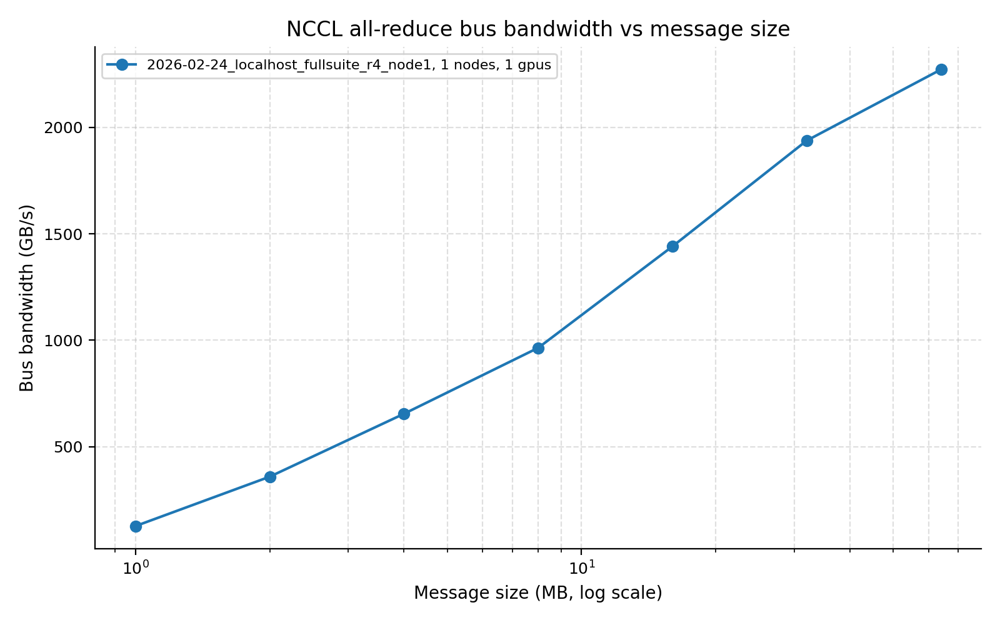
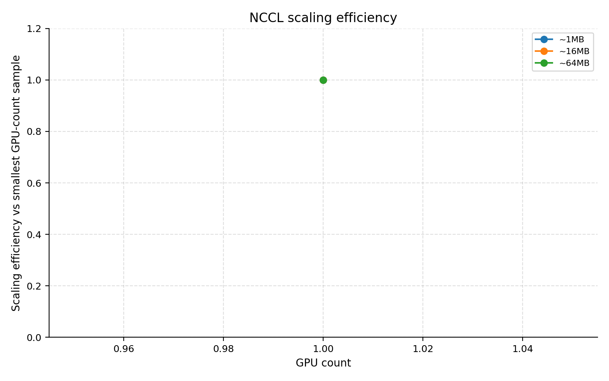
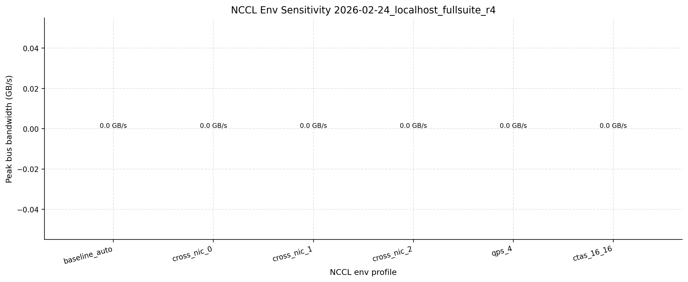
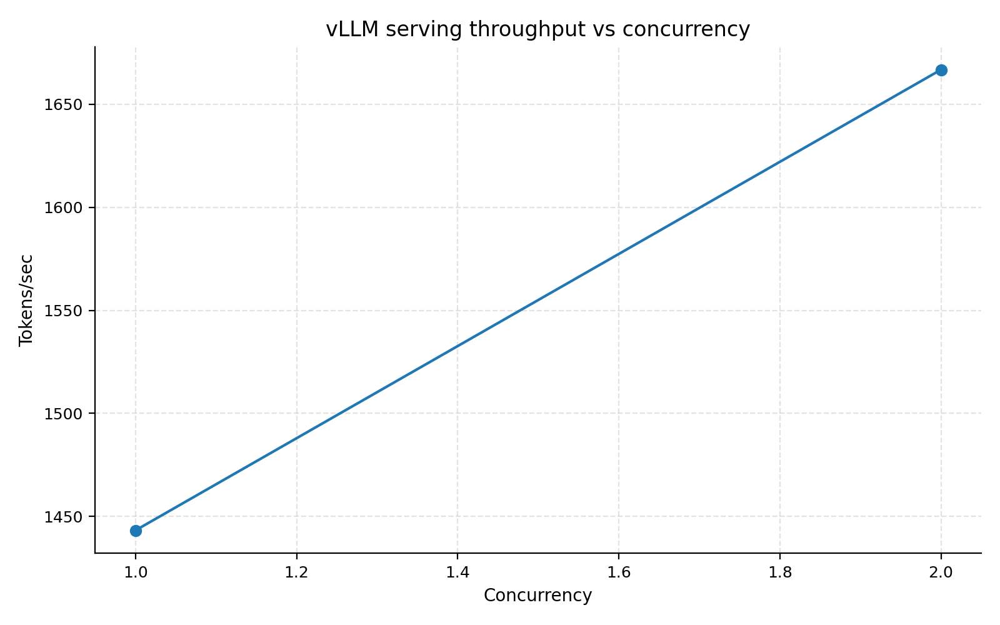
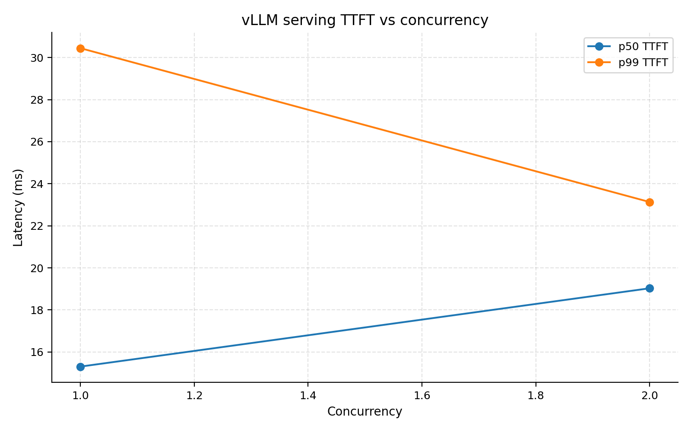
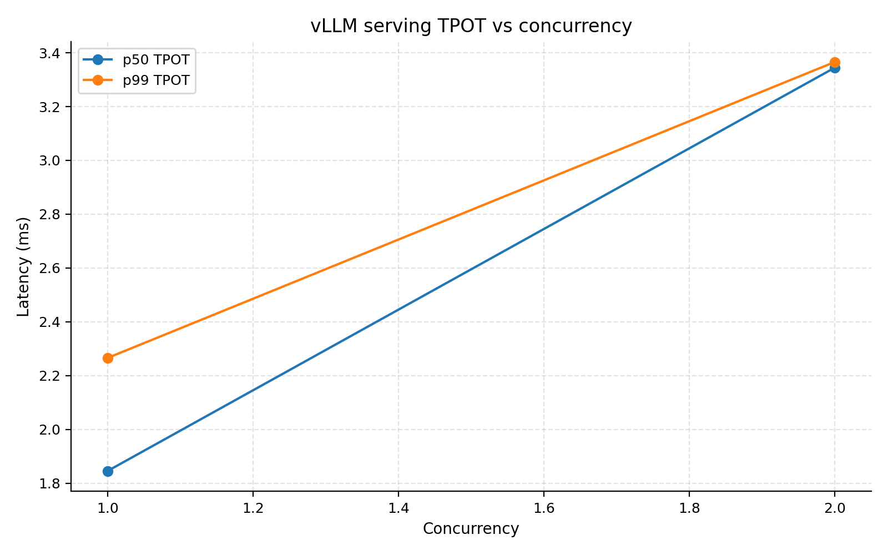
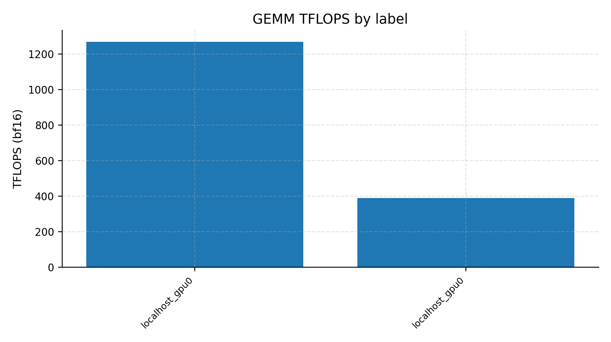
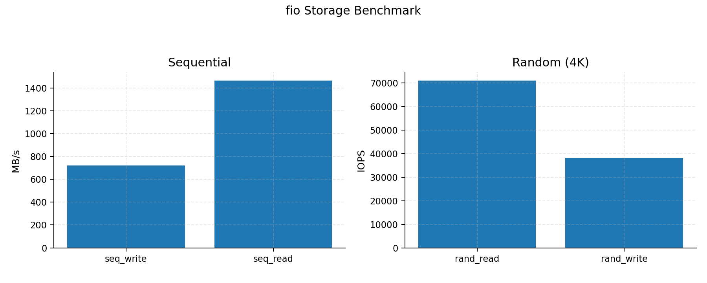
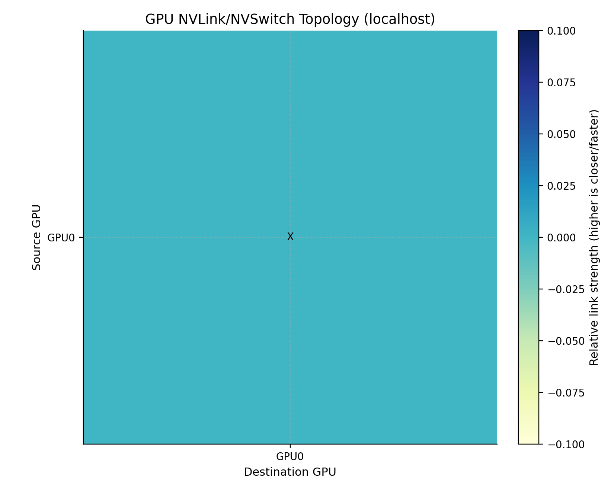
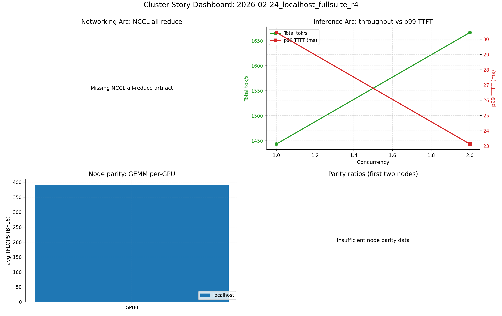

# Local Cluster/Perf Environment Report

## Status Note

This file is supplemental environment context only.

For localhost canonical reporting, always use the full template-style package:
- `cluster/field-report-localhost.md`
- `cluster/field-report-localhost-notes.md`

An environment report by itself is not an acceptable replacement for the localhost field-report package.

Last updated: 2026-02-24  
Machine: `ai-book-dev`  
Canonical local run in this report: `2026-02-24_localhost_fullsuite_r4`

## Table of Contents
1. [Summary](#summary)
2. [Run Status](#run-status)
3. [Template Alignment](#template-alignment)
4. [Performance Results](#performance-results)
5. [Visuals](#visuals)
6. [Key Findings](#key-findings)
7. [Artifacts](#artifacts)

## Summary

| Item | Value |
|---|---|
| GPU | NVIDIA B200 |
| GPU count | 1 |
| NVIDIA driver | 580.126.09 |
| CUDA version (nvidia-smi) | 13.0 |
| OS | Linux 6.8.0-94-generic |
| Arch | x86_64 |
| Local suite status | `OK` |
| Failed steps | `0 / 18` |

## Run Status

This report now uses `fullsuite_r4` (clean run after script fixes), not `fullsuite_r2`.

| Step | Exit code |
|---|---:|
| preflight_services | 0 |
| discovery | 0 |
| hang_triage_bundle | 0 |
| connectivity_probe | 0 |
| nccl_single_node | 0 |
| nccl_env_sensitivity | 0 |
| vllm_serve_sweep | 0 |
| gemm_sanity | 0 |
| fio_all_nodes | 0 |
| plot_nccl_single_node | 0 |
| plot_nccl_env_sensitivity | 0 |
| plot_vllm_serve | 0 |
| plot_gemm_sanity | 0 |
| plot_fio_2026-02-24_localhost_fullsuite_r4_localhost_fio | 0 |
| plot_nvlink_topology_2026-02-24_localhost_fullsuite_r4_localhost_meta | 0 |
| plot_cluster_story_dashboard | 0 |
| validate_required_artifacts | 0 |
| manifest_refresh | 0 |

## Template Alignment

| Question | Answer |
|---|---|
| Is this file the full canonical field-report template output? | No. This is a local-machine environment report (`results/structured/...environment_report.md`). |
| Where is the template-driven stakeholder report? | `cluster/field-report.md` and `cluster/field-report-notes.md` (currently tied to canonical run `2026-02-10_full_suite_e2e_wire_qf_mon`). |
| Why did this file look sparse before? | It was authored from an earlier troubleshooting run (`r2`) and did not yet include all visuals from clean run `r4`. |
| Does this file now include the local plots? | Yes. Visual links are included below for NCCL, vLLM, GEMM, fio, NVLink topology, and dashboard. |

## Performance Results

### vLLM Serve Sweep (`gpt2`, TP=1, ISL=128, OSL=64)

| Concurrency | Req/s | Total tok/s | p99 TTFT (ms) | p99 TPOT (ms) |
|---:|---:|---:|---:|---:|
| 1 | 7.372 | 1415.416 | 33.326 | 2.279 |
| 2 | 12.711 | 2440.542 | 22.376 | 2.597 |

### GEMM Sanity (BF16, 16384^3)

| GPU | avg ms | avg TFLOPS | app SM MHz | app MEM MHz |
|---:|---:|---:|---:|---:|
| 0 | 6.9238 | 1270.415 | 1965 | 3996 |

### Storage (fio)

| Test | Throughput |
|---|---:|
| seq_read MB/s | 1418.516 |
| seq_write MB/s | 724.310 |
| rand_read MB/s | 215.928 |
| rand_write MB/s | 124.696 |

### Connectivity + NCCL

| Check | Value |
|---|---|
| torchrun probe status | ok |
| torchrun world size | 1 |
| torchrun barrier mean (ms) | 0.0660 |
| torchrun payload algbw (GB/s) | 131.743 |
| NCCL single-node peak algbw (GB/s) | 2262.2 |
| NCCL peak message size (bytes) | 67108864 |
| NCCL env sensitivity status | ok (failures=0) |

## Visuals

NCCL:

vLLM:

Supporting:

## Key Findings

1. Local single-node suite is now fully green (`18/18` steps, `validate_required_artifacts=0`).
2. The two script-level blockers are resolved and verified in-run:
   - preflight DCGM false-negative flake removed
   - NVLink topology parser robust to this host format
3. vLLM scales from `1415.4` to `2440.5 tok/s` (conc 1->2) with low tail latency.
4. GEMM BF16 remains strong (`~1270 TFLOPS`), and fio improved versus prior local run.

## Artifacts

- `cluster/results/structured/2026-02-24_localhost_fullsuite_r4_manifest.json`
- `cluster/results/structured/2026-02-24_localhost_fullsuite_r4_suite_steps.json`
- `cluster/results/structured/2026-02-24_localhost_fullsuite_r4_torchrun_connectivity_probe.json`
- `cluster/results/structured/2026-02-24_localhost_fullsuite_r4_node1_nccl.json`
- `cluster/results/structured/2026-02-24_localhost_fullsuite_r4_nccl_env_sensitivity.json`
- `cluster/results/structured/2026-02-24_localhost_fullsuite_r4_localhost_vllm_serve_sweep.csv`
- `cluster/results/structured/2026-02-24_localhost_fullsuite_r4_localhost_gemm_gpu_sanity.csv`
- `cluster/results/structured/2026-02-24_localhost_fullsuite_r4_localhost_fio.json`
- `cluster/results/structured/2026-02-24_localhost_fullsuite_r4_localhost_meta_nvlink_topology.json`
